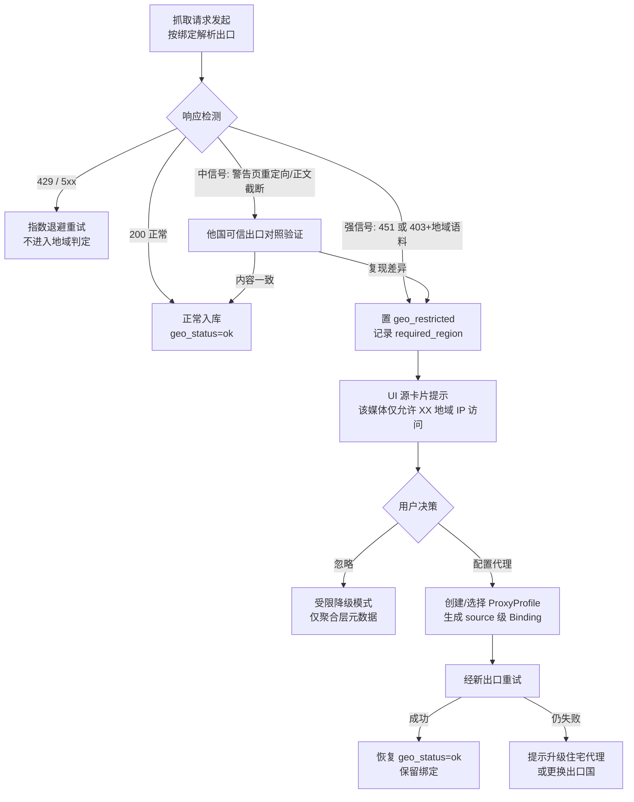
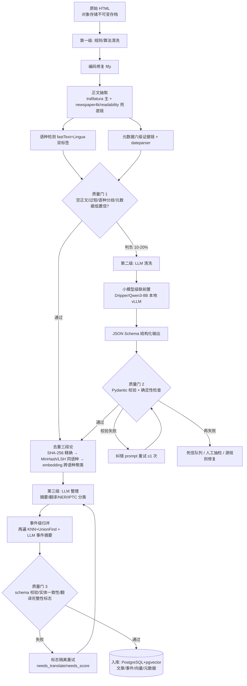
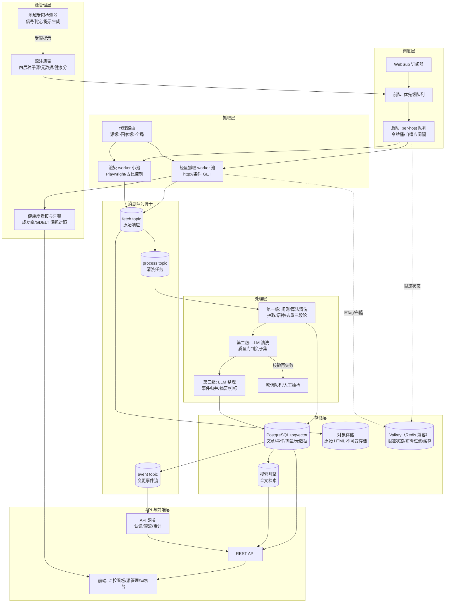
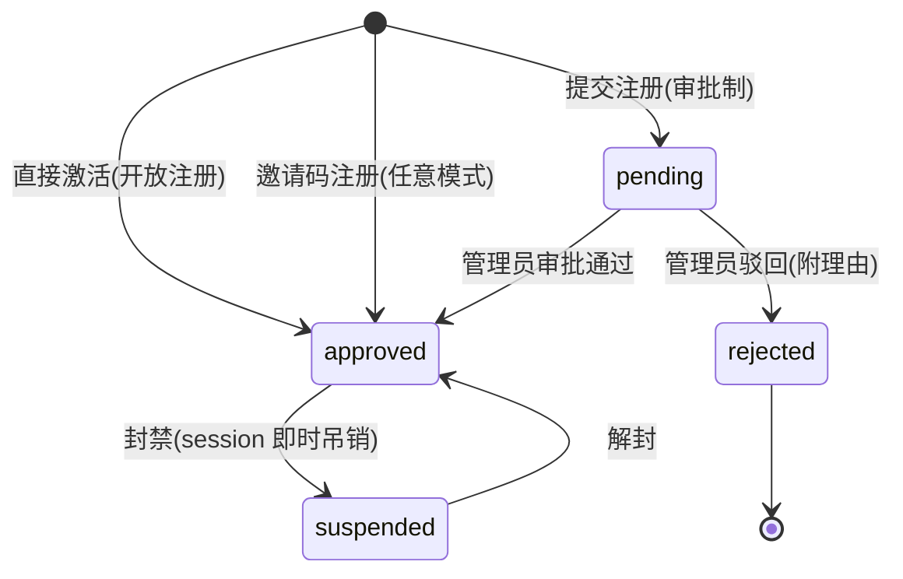
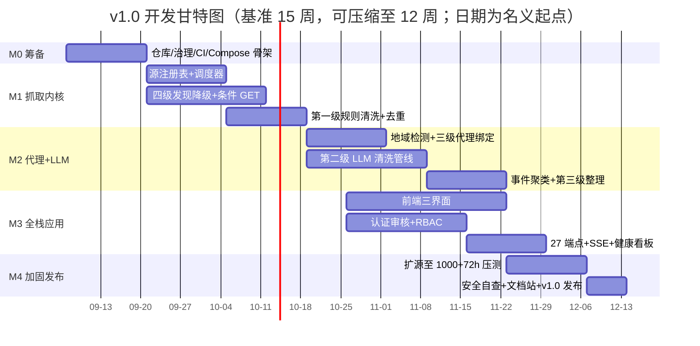

# 全球新闻媒体聚合监控平台 · 项目总体设计文档 v1.0

**文档版本**：v1.0  
**编制日期**：2026-08-25  
**项目性质**：完全开源（MIT 许可证）  
**文档范围**：项目需求整理与调研、同类开源应用借鉴分析、数据清洗管线设计、系统架构总体设计、技术栈选型、开发周期规划、开源策略与合规风险

---


## 1. 项目概述与需求总览

### 1.1 项目背景与愿景

全球新闻信息的生产高度分散：每个国家的主流通讯社、大报与公共广播电视各自维护独立站点与发布节奏，语言与访问策略互不统一。以 GDELT（Global Database of Events, Language, and Tone，全球事件、语言与语调数据库）为参照，全球被监测的新闻媒体域名规模达 6 万至 14 万家、覆盖 100 余种语言[^1-1^]；即便收敛到"国家级主流媒体"口径，学术界常用的 Media Cloud 清单也已达 177 个国家、1,064 家媒体[^1-2^]。如此规模的源集合无法靠手工订阅持续跟踪，而商业聚合服务以闭源、付费、数据不可控的形态提供。开源生态中虽有 RSSHub、Miniflux、changedetection.io 等优秀组件，但逐一考察可见明确的功能断层：阅读器只解决"订阅与阅读"，变更检测工具只解决"页面是否变化"，两者都不提供"全球主流媒体清单 + 准实时监控 + 文章级结构化处理"的完整闭环，也均无地域 IP 受限媒体的检测与提示机制（逐项对比见第 2 章）。本项目的目标是补齐这一空缺：建设一套开源、可自托管、面向全球的新闻媒体实时监控聚合基础设施。

项目愿景可表述为四个可验证的工程目标：维护一份覆盖全球各国的主流媒体清单并实施 24 小时监控，源更新即触发抓取，达到分钟级准实时入库；对抓取内容执行"规则清洗 → 大语言模型（Large Language Model, LLM）清洗 → LLM 整理"三级处理，将异构网页转化为结构化、可检索的新闻记录；对地域 IP 受限媒体实现自动检测与文字化提示；全部成果以最宽松的 MIT 许可证开源。

### 1.2 核心功能需求（来自用户原始需求）

以下需求项直接转写自项目发起人的原始需求，作为后续各章设计与验收的依据。

第一，媒体源清单。锁定全球所有国家的主流媒体并持续维护。清单采用"种子源库 + 社区共建"双轨：初始化时内置一批经策展的核心源，此后依靠开源社区贡献扩充与修正（分层策略见第 3 章）。

第二，准实时监控。对清单内媒体执行 24 小时监控，源更新即抓取最新新闻。其实质是"变更检测 + 事件驱动抓取"：有 RSS/Atom 订阅源的媒体走 feed 轮询，无 feed 媒体走站点地图（sitemap）与列表页变更检测，检测到变更即触发文章级抓取，而非定时批量重抓（见第 3、5 章）。

第三，地域 IP 限制的检测与提示。部分媒体仅允许本国 IP 访问——典型如 GDPR（General Data Protection Regulation，欧盟《通用数据保护条例》）生效后《洛杉矶时报》《芝加哥论坛报》等数十家美国媒体直接屏蔽欧盟 IP[^1-3^]。系统须识别此类限制（核心信号为 HTTP 451 状态码及可复现的 403 地域拦截页[^1-4^]），并以文字提示用户"需要添加 xx 地域的代理"。系统不内置任何代理服务，采用"用户自带代理"（Bring Your Own Proxy, BYO Proxy）模式：检测与提示由系统负责，代理资源的获取、配置及相应合规责任由用户承担[^1-5^]。

第四，数据处理三级管线。原始网页依次经过：第一级规则清洗，以确定性抽取算法剥离广告、导航等模板噪声；第二级 LLM 清洗，修正残留的噪声、乱码与内容混杂；第三级 LLM 整理，完成分类、摘要、实体提取等结构化加工。规则先行、LLM 殿后是有意的成本控制决策：规则清洗零边际成本，使昂贵的 LLM 调用只处理已减量、已净化的文本（见第 4 章）。

第五，全栈应用形态。交付物是完整应用而非爬虫脚本，包含前端界面、后端服务、对外 API 端点与用户身份审核机制，支持多用户注册审核与权限隔离（见第 5 章）。

第六，完全开源与 MIT 许可证。全部代码以 MIT 发布，不要求完全自研：许可兼容（MIT/Apache-2.0/BSD）的知名开源组件可直接集成，copyleft 许可（AGPL/GPL）组件仅借鉴设计或作为独立服务调用（见第 2、6 章）。

### 1.3 范围与非目标

v1.0 覆盖目标依据调研估算设定为约 1,000–2,500 家核心主流媒体（按"150+ 国家 × 每国 5–15 家通讯社/大报/国家台"推算）、30–50 个主要语种[^1-6^]。这一量级刻意不宣称"全网覆盖"：有流量影响力的媒体上限约 3,000 家，全部媒体域名则达 6 万家以上[^1-6^]，v1.0 只承诺"主流覆盖"。用户生成内容（User-Generated Content, UGC）与社交媒体平台的抓取不在范围内，因其平台条款、反爬强度与内容形态均与新闻媒体存在根本差异。

非目标以硬约束形式列出。其一，不分发文章全文：美国 AP v. Meltwater 判例已认定，新闻监测摘要若"替代用户阅读原文的需要"即构成侵权[^1-7^]；欧盟 DSM 指令第 15 条的出版者邻接权也只豁免超链接与"极短摘录"（very short extracts）[^1-8^]。系统对外输出因此默认为"标题 + 短摘要 + 原文链接"，全文仅限用户本地使用（合规红线详见第 8 章）。其二，不内置商业代理服务：项目不分发、不集成、不代售任何代理资源，仅定义代理配置接口。

### 1.4 目标用户与使用场景

v1.0 面向具备自托管能力的三类用户：需要全球新闻数据管道的开发者，可将结构化新闻流接入自有应用；学术与政策研究机构，用于跨国舆情与媒体议程研究，自托管保证数据留存与处理过程可控、可复现；媒体监测与公关团队，用于跟踪特定国家与媒体的报道动态，多用户与身份审核机制对应其协作场景。三者共同特征是数据自主权优先于使用便利性，这正是开源自托管形态相对商业 SaaS 的核心竞争力。平台化 SaaS 部署在架构上不做排除性设计，但列为 v1.0 之后的演进方向，不在本期交付范围。

---

### 本章参考来源

[^1-1^]: PEIO14 论文 "Media Visibility of International Organizations Worldwide"（GDELT 处理约 6 万家媒体）https://www.peio.me/wp-content/uploads/PEIO14/PEIO14_paper_122.pdf ；MDPI Data 2026（GDELT 记录 141,289 家不同媒体）https://www.mdpi.com/2306-5729/11/7/158
[^1-2^]: arXiv 2501.14040 "Global Perspectives of AI Risks and Harms"（Media Cloud 清单：177 个国家 1,064 家国家级新闻媒体）https://arxiv.org/pdf/2501.14040v2
[^1-3^]: Security World Market — "US news sites block EU users to avoid GDPR regs"（洛杉矶时报、纽约每日新闻、芝加哥论坛报等屏蔽欧盟 IP）https://www.securityworldmarket.com/int/Newsarchive/us-news-sites-block-eu-users-to-avoid-gdpr-regs1
[^1-4^]: InventiveHQ — lesser-known HTTP status codes（HTTP 451 语义：法院命令、政府封锁、GDPR 驱动的地域限制）https://inventivehq.com/blog/lesser-known-http-status-codes ；Novada — "HTTP error 451 in production"（451 是比 403 更明确的地域限制信号及判别清单）https://www.novada.com/blog-ordinary/http-error-451-in-production-how-to-tell-legal-blocks-from-anti-bot-failures/
[^1-5^]: Novada — "HTTP error 451 in production"（不理解法律边界而强行跨区访问属不良实践，绕过决策应由用户做出）https://www.novada.com/blog-ordinary/http-error-451-in-production-how-to-tell-legal-blocks-from-anti-bot-failures/
[^1-6^]: PEIO14 论文（GDELT 域名 ∩ 各国流量 Top 500 = 2,653 个主流域名）https://www.peio.me/wp-content/uploads/PEIO14/PEIO14_paper_122.pdf ；arXiv 2501.14040（1,064 家/177 国口径）https://arxiv.org/pdf/2501.14040v2 ；Aalto University Data Hub — The GDELT Database（100+ 语言覆盖）https://datahub.aalto.fi/en/data-sources/the-gdelt-database
[^1-7^]: 安全内参 — AI 时代数据爬取治理（AP v. Meltwater 2013：摘要替代阅读原文需要、损害版权人市场、不具转换性）https://www.secrss.com/articles/79802
[^1-8^]: Wolters Kluwer Copyright Blog — Article 15 "very short extracts" 限制（超链接、单个词与极短摘录被排除于出版者邻接权之外）https://legalblogs.wolterskluwer.com/copyright-blog/taking-freedom-of-information-seriously-the-very-short-extracts-limitation-in-article-15-cdsm-directive-and-how-not-to-implement-it-part-1/


---


## 2. 同类开源应用调研与借鉴分析

第 1 章确立了本项目的六大核心需求：全球主流媒体锁定、24 小时监控即更即抓、地域代理文字提示、三级清洗（规则清洗 → LLM 清洗 → LLM 整理）、全栈交付与身份审核、MIT 开源。本章基于对开源生态的系统调研（覆盖 GitHub 仓库页、官方文档、PyPI/pkg.go.dev 及多组独立基准论文）回答一个前置问题：**哪些环节必须自研，哪些环节可以站在成熟开源项目的肩膀上**。调研结论先行：本项目不存在"从零造轮子"的必要——正文抽取、feed 解析、浏览器渲染、变更检测四层均有宽松许可的头部组件可直接集成；真正需要自研的是地域代理编排闭环、LLM 两级清洗管线和全球主流媒体清单库。与此同时，AGPL/GPL 传染性许可证（RSSHub、FreshRSS、Firecrawl 核心、Tiny Tiny RSS）构成了 MIT 项目必须绕开的合规边界，本章 2.4 节给出完整的合规矩阵与借鉴路线图，为第 4/5/6 章的管线设计、架构分层与技术选型提供组件候选依据。

### 2.1 新闻聚合与监控类项目全景

新闻聚合与监控是开源世界的传统赛道，既有 RSS 阅读器系（Miniflux、FreshRSS、Tiny Tiny RSS、NewsBlur）、RSS 生成系（RSSHub），也有新兴的实时热榜聚合（NewsNow）与通用变更检测（changedetection.io）和监控自动化（Huginn）。它们的能力边界与许可证属性差异巨大，直接决定了"能抄什么、只能看什么"。表 1 汇总了与本项目最相关的 12 个项目的硬事实。

**表 1：同类开源项目对比总表**（Stars 为 2025 下半年至 2026 年中各来源快照，存在 ±10% 误差；许可证以仓库 LICENSE 文件为准）

| 项目 | Stars | 技术栈 | 许可证 | 核心能力 | 对本项目可复用点 | 主要局限 |
|---|---|---|---|---|---|---|
| RSSHub | 45.8k | TypeScript / Node.js（Hono） | **AGPL-3.0** | 全球最大 RSS 生成网络，数千条路由、5000+ 公共实例[^2-1^] | 媒体源清单与路由规则知识库；可自建实例网络调用 | AGPL 传染性，路由代码不可复制；路由质量参差 |
| NewsNow | ~20.2k | TypeScript / Nuxt / Cloudflare Pages | MIT | 实时热门聚合 UI；按源更新频率自适应抓取间隔（最快 2 分钟）[^2-2^][^2-3^] | 数据源抽象、自适应频率调度、聚合 UI | 只抓热榜标题不抓正文；无地域/代理概念 |
| Miniflux | ~9.2k | Go 单二进制 + PostgreSQL | Apache-2.0 | 极简阅读器；全文抓取、Rewrite/Scraper 规则、REST API[^2-4^] | Go 生态 feed 轮询调度最佳参考；按域名的重写规则机制 | 是阅读器而非监控管线；无变更推送与 LLM 环节 |
| FreshRSS | 15.5k | PHP 8.1+ / SQLite·MySQL·PG | **AGPL-3.0** | 多用户聚合；WebSub 即时推送；XPath 抓站补无 RSS 站点[^2-5^] | WebSub 协议级"即更即推"思路、XPath 抓站机制 | AGPL 不可复制；PHP 栈与 AI 管线不搭 |
| Tiny Tiny RSS | 万级 | PHP / Docker | **GPL-3.0** | 老牌阅读器；插件体系、含图片感知哈希的去重[^2-6^] | 去重设计、插件机制可参考 | GPL 传染性；原作者 2025-11 停更，社区 fork 接手[^2-6^] |
| NewsBlur | 6k+ | Python(Django)/Node + 3 种数据库 | MIT | Intelligence Trainer 按作者/关键词/标签打分过滤[^2-6^][^2-7^] | "规则打分降噪"成熟范本，对应规则清洗阶段 | 自托管过重（MongoDB+Redis+PG）；偏阅读器 |
| Huginn | 49.6k | Ruby on Rails / MySQL·PG | MIT | 自托管 IFTTT；Agent 产生/消费事件并沿有向图传播[^2-8^] | 事件驱动有向图是"监控→抓取→清洗→整理"管线范本 | 最后 release 停在 2022-08，600+ open issues，维护放缓[^2-9^] |
| changedetection.io | 32.2k | Python(Flask) / Playwright | Apache-2.0 | 网页变更检测；CSS/XPath/JSONPath/jq 过滤；**按监控项配置代理**；内置 LLM 智能过滤[^2-10^][^2-11^] | 与"24h 监控+地域代理提示"需求最近似的现存实现 | 目标是"检测变化"而非"抓正文入库"；无媒体源目录 |
| trafilatura | ~5.6k | Python（另有 Rust/Go 移植） | Apache-2.0（1.8.0 起） | 正文+元数据抽取基准第一梯队：ScrapingHub 基准 F1 0.958[^2-12^][^2-13^] | **直接集成**为规则清洗主力抽取器 | 不处理 JS 渲染页；短页面召回差 |
| newspaper4k | ~1.1k | Python / lxml / 可选 NLTK | MIT | newspaper3k 维护续作；80+ 语言；作者/日期/顶图元数据[^2-12^] | 新闻专用元数据抽取兜底 | 基准速度最慢档（1305s/1502 页）[^2-13^] |
| Fundus | 千级 | Python | MIT | 逐站定制 parser（PublisherCollection），抽取精度 F1 97.69% 为各基准最高[^2-14^][^2-15^] | "主流媒体逐站定制解析器"路线与 parser 注册/版本化设计 | 现成 parser 以美英德为主，中文/多国媒体需自建 |
| Crawlee | ~24k | TS + Python 双栈 / Playwright | Apache-2.0 | HTTP+无头浏览器统一接口、自动并行、代理轮换、会话管理、持久化队列[^2-16^][^2-17^] | 浏览器渲染层首选直接集成项 | 需自管代理池 |

表 1 揭示了三条结构性规律。其一，**高 Stars 不等于可复用**：Stars 最高的 RSSHub（45.8k）恰恰因 AGPL-3.0 成为"只可远观"的项目，其价值只能以"自建实例网络调用 + 人工研读路由规则"的方式间接释放。其二，**需求近似度与项目定位错位**：与"24 小时监控 + 地域代理"最近似的 changedetection.io 止步于"页面变了"的通知，不做文章级结构化入库；而做正文入库的阅读器系项目又不具备变更检测与代理模型——这一空档正是本项目的生态位。其三，**许可证与维护状态呈正相关风险**：GPL/AGPL 阵营中 TT-RSS 已现原作者停更事件，宽松许可阵营（Miniflux、trafilatura、Crawlee）则保持活跃发版，这从供应链安全角度进一步支持"核心依赖只用宽松许可"的选型纪律。

#### RSS 生态的能力边界

RSS 生态五杰（RSSHub、Miniflux、FreshRSS、Tiny Tiny RSS、NewsBlur）对本项目的主要价值在**调度与存储层参考**而非直接组件。RSSHub 的数千条路由沉淀了全球媒体"栏目结构、列表页 URL 模式、更新入口"的近 8 年社区知识，是构建媒体源注册表的最佳参照，但其 AGPL-3.0 许可证（早期为 MIT，变更时点需以 LICENSE 提交历史复核）决定了路由代码一行也不能复制进 MIT 代码库[^2-1^]。FreshRSS 的 WebSub（PubSubHubbub）支持指出了实现"即更即抓"的协议级捷径——对支持推送的源走 WebSub，其余走自适应轮询[^2-5^]。Miniflux 的 Rewrite/Scraper Rules 展示了按域名组织抓取规则的优雅数据模型[^2-4^]；NewsBlur 的 Intelligence Trainer 则验证了"规则打分降噪"的可行性，直接对应本项目规则清洗阶段的设计语义[^2-7^]。NewsNow 虽只抓热榜标题，但其"按源更新频率自适应调整抓取间隔（2 分钟至 30 分钟分级）"的调度策略，正是高频媒体快轮询、低频媒体慢轮询的工程范本[^2-3^]。

#### 变更检测与监控自动化的架构借鉴点

changedetection.io 与 Huginn 分别代表了监控层的两种成熟范式。changedetection.io 的 watch 模型（URL + 选择器 + 频率 + 代理 + 通知路由）与"Configurable proxy per watch"设计，是目前开源界对"按监控项配置地域代理"最完整的实现，其已内置 OpenAI/Gemini/Ollama/LiteLLM 智能过滤的事实也验证了"变更检测 + LLM 清洗"组合的可行性[^2-10^][^2-11^]。Huginn 的"Agent 产生事件、事件沿有向图传播"模型与本文第 4 章将定义的"监控事件 → 抓取事件 → 规则清洗 → LLM 清洗 → LLM 整理"多级流水线在架构上完全同构，且 MIT 许可证允许自由研读其代码[^2-8^]；但其最后正式版本停留在 2022 年 8 月、积累 600+ open issues 的维护现状决定了只能"借架构，不依赖运行"[^2-9^]。

### 2.2 正文抽取与清洗组件

正文抽取是"三级清洗"中第一级（规则清洗）的物理基础，也是开源生态中基准数据最充分的一层。2025–2026 年多组独立评测给出了清晰的结论：在 ScrapingHub 文章抽取基准上，**trafilatura 以 F1 0.958（precision 0.938 / recall 0.978）位居第一梯队之首**，优于 newspaper4k（0.949）、@mozilla/readability（0.947）、readability-lxml（0.922）与 goose3（0.896）[^2-13^]；在更宽泛的 WCXB 基准（1502 个多类型页面）上，trafilatura Python 版仍以 F1 0.792 居传统启发式工具首位[^2-13^]。trafilatura 已被 HuggingFace、IBM、Microsoft Research、Stanford 等机构用于生产，输出 text/Markdown/JSON 等 7 种格式且 JSON 含标题/作者/日期元数据，1.8.0 起许可证由 GPLv3 变更为 Apache-2.0，可直接集成（需 pin ≥1.8.0 版本）[^2-12^]。其已知短板——不处理 JS 渲染页、超短页面召回差——恰好由兜底梯队补足：**newspaper4k**（MIT）以 80+ 语言检测和最全的新闻元数据（作者/日期/顶图）充当失败重试通道，尽管其速度垫底（1305 秒/1502 页，约为 trafilatura 的 9 倍）[^2-12^][^2-13^]；**readability-lxml**（Apache-2.0）与 **jusText** 则作为轻量 fallback 链末端的保结构清洗器（trafilatura 自身的 fallback 链即内置了这两者）[^2-12^]。

在逐站定制维度，柏林洪堡大学的 **Fundus**（MIT）提供了另一条被验证的路线：为每家媒体手工定制 parser（PublisherCollection 按国家组织），在段落级标注基准上取得 F1 97.69%，为所有参评开源工具最高[^2-14^][^2-15^]。这印证了本项目"锁定主流媒体"的正确姿势——头部媒体走逐站定制 parser，长尾媒体走通用抽取器；其 parser 注册表与属性版本化设计可直接借鉴，但现成 parser 以美英德媒体为主，中文、日韩、中东、拉美媒体需自行扩充[^2-14^]。渲染层方面，**Crawlee**（Apache-2.0，TS+Python 双栈）以"HTTP 与无头浏览器统一接口 + 自动并行 + 代理轮换 + 会话管理 + 持久化队列"成为浏览器渲染基础设施的首选[^2-16^]；**Crawl4AI**（Apache-2.0，70k+ stars）的 fit_markdown 去模板噪声与"先确定性规则抽取、失败再 LLM 抽取"双路径，与本项目"先规则清洗、再 LLM 清洗"的两级策略完全同构，可直接集成或作为设计蓝本[^2-17^][^2-18^]。需要警惕的是 Stars 高达 130k–151k 的 **Firecrawl**：其核心为 AGPL-3.0（仅 SDK 与部分 UI 为 MIT），代码不可复制，仅可参考其"API 层 / 渲染微服务 / Redis 队列"的分离架构或作为付费 API 兜底[^2-19^]。

### 2.3 全球新闻数据源与媒体清单项目

"全球主流媒体锁定"需求的前提是一份可信的媒体清单。调研发现三个可直接利用的开放来源。**GDELT Project** 是全球最大开放新闻事件库，覆盖 100+ 国家、100+ 语言（65 种实时机器翻译）、每 15 分钟更新，持续处理的媒体域名规模在不同研究中为 6 万–14 万家（一项研究记录 141,289 个不同媒体域名，其中 Alexa 全球 Top 500 新闻媒体命中 442 家，覆盖率 88.4%）[^2-20^][^2-21^][^2-22^]。其 DOC 2.0 API 免密钥、支持 sourcecountry/sourcelang 过滤，但不返回正文、仅滚动 3 个月窗口、限速约每 5 秒 1 次[^2-23^]——因此 GDELT 对本项目的价值不在数据本身，而在三重对照角色：媒体清单完备性基准、冷启动回填源、"漏抓检测"告警信号。**Media Cloud**（哈佛/MIT 联合）则提供人工策展的国家级清单：其 Global English Language Sources 收录 177 国 1,064 家国家级新闻媒体，总档案逾 20 亿篇报道、6 万余媒体[^2-24^][^2-25^]；其"管理媒体源与 feed → 定时爬取 feed 下载新文章 → 抽取正文打标签"的系统三步走与本项目管线高度同构，后端虽为 AGPL-3.0，但 API 客户端为 MIT，其 collection/source/feed 目录 API（v4）可直接作为清单种子[^2-26^][^2-27^]。**newscatcher** 开源包（MIT，已停更）证明了"一个 SQLite 存全网媒体 RSS 端点 + feedparser 封装"即可撑起可用的全球聚合器，其媒体→RSS 端点数据库可提取为清单种子；其作者转向的商业 Newscatcher API（宣称 70,000+ 源）则构成产品对标——本项目开源版的差异化恰在 LLM 清洗整理、地域代理与用户自控[^2-28^][^2-29^]。综合三源交叉校验，本项目首期种子库的合理目标为 150+ 国家、1,000–2,500 家核心源、30–50 语种。

### 2.4 许可证合规矩阵与借鉴路线图

本项目采用 MIT 许可证，对上游组件许可证的容忍度直接决定集成方式。表 2 将调研涉及的组件按许可证传染性分为三档，给出各自的合规使用方式。

**表 2：许可证兼容矩阵（面向 MIT 主项目）**

| 档位 | 许可证 | 涉及项目 | 合规使用方式 |
|---|---|---|---|
| ✅ 可直接集成 | MIT | NewsNow、Huginn、NewsBlur、newspaper4k、Fundus、gofeed、newscatcher、MediaCloud API 客户端、Firecrawl SDK | 可复制代码/引入依赖，保留版权声明 |
| ✅ 可直接集成 | Apache-2.0 | Miniflux、changedetection.io、trafilatura（≥1.8.0）、readability-lxml、news-please、Crawlee、Crawl4AI | 同上；注意保留 NOTICE 与许可证文本 |
| ✅ 可直接集成 | BSD-2/3-Clause | feedparser、Scrapy、Scrapling | 同上 |
| ⚠️ 仅网络调用/参考设计 | AGPL-3.0 | RSSHub、FreshRSS、Firecrawl 核心、MediaCloud 后端 | 自建实例作独立服务网络调用；阅读源码获取设计灵感；**不可复制代码进 MIT 仓库** |
| ⚠️ 仅参考设计 | GPL-3.0 | Tiny Tiny RSS（及 trafilatura <1.8.0 旧版） | 仅研读设计；trafilatura 必须 pin ≥1.8.0 |
| ○ 数据/服务类 | 开放数据/API 条款 | GDELT（数据 100% 免费开放）、MediaCloud 目录 API（研究用途注册）、Newscatcher API（商业） | 无代码许可问题，但引用清单数据须遵守各平台 ToS 与署名要求 |

表 2 的核心含义是：本项目四大核心依赖层——feed 解析（feedparser/gofeed）、正文抽取（trafilatura/newspaper4k）、渲染（Crawlee）、变更检测（changedetection.io，v1.0 仅参考设计、抓取 worker 内建实现）——全部落在宽松许可档，供应链合规风险可控；而生态中声量最大的 RSSHub 与 Firecrawl 恰落在 AGPL 档，必须在 CI 中加入许可证扫描（如 scancode/FOSSA）防止传递依赖误引入[^2-1^][^2-19^]。trafilatura 的许可证变更史（GPLv3 → Apache-2.0）也提示：依赖版本锁定不仅是工程问题，更是合规问题。

#### 借鉴路线图

综合本章调研，按"集成—参考—自研"三档收敛如下，直接作为第 5、6 章架构与选型的输入：

- **直接集成清单**（宽松许可，工程收益最大）：`feedparser`（PyPI 累计下载 3.1 亿+）或 `gofeed` 作 feed 解析底座[^2-30^][^2-31^]；`trafilatura` 主力抽取 + `newspaper4k` 元数据兜底 + readability fallback 构成规则清洗第一梯队；`Crawlee + Playwright` 承担 JS 渲染与代理轮换；`Crawl4AI` 的 fit_markdown 思路降低 LLM 清洗 token 成本；`changedetection.io` 的 watch 模型（URL + 选择器 + 频率 + 代理 + 通知路由）与 per-watch proxy 设计作为变更检测与代理绑定的实现蓝本——v1.0 的变更检测能力由抓取 worker 内建实现（ETag/内容哈希，见第 5 章），避免引入额外服务；若未来需要其 LLM 智能过滤等高级能力，再以其独立服务形态嵌入。
- **参考设计清单**（读架构与规则，自研实现）：RSSHub 路由生态 → 自建"媒体源注册表"（列表页模式/栏目/RSS 端点/更新频率/地域/语言）；Fundus 模式 → 头部媒体逐站定制 parser；Huginn 事件有向图 → 五级管线解耦与事件重放；NewsNow 自适应频率 + FreshRSS 验证的 WebSub → 调度器分级轮询与推送混合；Firecrawl 架构 → API 层/渲染微服务/队列分离的水平扩展形态；NewsBlur 打分过滤与 Scrapling 自适应选择器 → 规则降噪与"媒体改版自愈"机制。
- **必须自研清单**（生态中无现成方案）：地域代理编排闭环（检测地域限制 → 文字提示用户配置对应地域代理 → 按国家路由，changedetection.io 仅有 per-watch proxy 字段而无检测—提示闭环）；LLM 清洗/整理两级管线（所有抽取工具止步于干净正文，LLM 去噪纠错与结构化整理是本项目差异化核心）；全球主流媒体清单库（融合 GDELT 域名全集、Media Cloud 国家级清单、newscatcher 端点库、RSSHub 路由目录四源去重富化）；以及以 GDELT 15 分钟级更新为基准的监控完备性对照与漏抓告警。

---

### 本章参考来源（脚注定义沿用调研报告 R1/R2 的原始来源）

[^2-1^]: DIYgod/RSSHub — GitHub 仓库页（45.8k stars，AGPL-3.0，5000+ 实例）：https://github.com/diygod/rsshub
[^2-2^]: ourongxing/newsnow — GitHub README（MIT；shared/sources 结构；停止接受贡献公告）：https://github.com/ourongxing/newsnow
[^2-3^]: 阿里云开发者社区《NewsNow：开源个性化新闻聚合平台》（自适应抓取间隔最快 2 分钟）：https://developer.aliyun.com/article/1656649
[^2-4^]: DANIAN — Miniflux 项目档案（9.2k stars，Apache-2.0，单二进制+PostgreSQL）：https://danian.co/miniflux
[^2-5^]: DEV.co — FreshRSS 档案（15.5k stars，AGPL-3.0，WebSub 与 XPath 抓站）：https://dev.co/devops/open-source/freshrss
[^2-6^]: youngju.dev — RSS Readers & Read-Later 2026 Deep Dive（TT-RSS 停更；NewsBlur MIT 与 Intelligence Trainer）：https://www.youngju.dev/blog/culture/2026-05-16-rss-readers-read-later-2026-reeder-netnewswire-inoreader-feedbin-miniflux-freshrss-karakeep-deep-dive.en
[^2-7^]: samuelclay/NewsBlur — GitHub 仓库与 LICENSE（MIT）：https://github.com/samuelclay/newsblur
[^2-8^]: OpenAgentSkill — Huginn 档案（MIT，Agent 有向图架构）：https://www.openagentskill.com/skills/huginn-huginn
[^2-9^]: linux-server-admin wiki — Huginn 状态页（600+ open issues，维护放缓）：https://wiki.linux-server-admin.com/software/automation/huggin
[^2-10^]: DEV.co — changedetection.io 档案（32.2k stars，Apache-2.0，LLM 智能过滤）：https://dev.co/devops/open-source/changedetection-io
[^2-11^]: PyPI — changedetection.io 官方说明（CSS/XPath/JSONPath/jq；Configurable proxy per watch）：https://pypi.org/project/changedetection.io/
[^2-12^]: contextractor.com — Trafilatura vs. Readability vs. Newspaper4k（1.8.0 起 Apache-2.0；各自失效模式）：https://www.contextractor.com/trafilatura-vs-readability-vs-newspaper/
[^2-13^]: Murrough-Foley/rs-trafilatura Releases — 1,502 页基准与 ScrapingHub 基准 F1 对比表：https://github.com/Murrough-Foley/rs-trafilatura/releases
[^2-14^]: htdocs.dev — Comparative Analysis of Open-Source News Crawlers（Fundus F1 97.69% 最高）：https://htdocs.dev/posts/comparative-analysis-of-open-source-news-crawlers/
[^2-15^]: Fundus 论文（MIT；逐站定制 parser；CC-NEWS）：https://arxiv.org/html/2403.15279v1
[^2-16^]: apify/crawlee-python — README（Apache-2.0；代理轮换、会话管理、持久化队列）：https://github.com/apify/crawlee-python
[^2-17^]: Scrapfly — 10 Best Open-Source Web Scrapers in 2026（2026-06 star 快照横向评测）：https://scrapfly.io/blog/posts/best-open-source-web-scrapers
[^2-18^]: ScrapingBee — Crawl4AI 完全指南（fit_markdown 省 token；规则/LLM 双路径抽取）：https://www.scrapingbee.com/blog/crawl4ai/
[^2-19^]: firecrawl/firecrawl — GitHub 与 LICENSE（核心 AGPL-3.0，SDK 与部分 UI 为 MIT）：https://github.com/firecrawl/firecrawl
[^2-20^]: GDELT Project 官网（100% free and open；100+ 国家）：https://www.gdeltproject.org/
[^2-21^]: PEIO14 paper "Media Visibility of International Organizations Worldwide"（GDELT 处理约 6 万媒体；Top500/国过滤得 2,653 域名）：https://www.peio.me/wp-content/uploads/PEIO14/PEIO14_paper_122.pdf
[^2-22^]: MDPI Data 2026（GDELT 记录 141,289 家媒体；Alexa Top 500 命中 442 家 = 88.4%）：https://www.mdpi.com/2306-5729/11/7/158
[^2-23^]: APITube 迁移文档与 Jentic GDELT API 说明（DOC 2.0 免 key、不返回正文、3 个月窗口、约 1 req/5s）：https://docs.apitube.io/platform/migrations/from-gdelt ; https://jentic.com/apis/api.gdeltproject.org/gdelt
[^2-24^]: arXiv 2501.14040（Media Cloud 1,064 家国家级媒体 / 177 国清单）：https://arxiv.org/pdf/2501.14040v2
[^2-25^]: SAS Publishers 论文（Media Cloud 逾 20 亿篇报道、60,000+ 媒体档案）：https://www.saspublishers.com/media/articles/SJAHSS_139_320-334.pdf
[^2-26^]: mediacloud/backend — GitHub（AGPL-3.0；源管理→爬 feed→抽取打标签三步）：https://github.com/mediacloud/backend
[^2-27^]: PyPI — mediacloud Python API 客户端（MIT；API v4 目录浏览）：https://pypi.org/project/mediacloud/
[^2-28^]: kotartemiy/newscatcher — GitHub（MIT；SQLite 媒体 RSS 端点库 + feedparser 封装）：https://github.com/kotartemiy/newscatcher
[^2-29^]: NewsCatcher API 官网（70,000+ 源商业服务对标）：https://www.newscatcherapi.com/
[^2-30^]: pepy.tech — feedparser（BSD-2-Clause，累计 3.1 亿+ 下载）：https://pepy.tech/projects/feedparser
[^2-31^]: pkg.go.dev — mmcdole/gofeed（MIT；RSS/Atom/JSON Feed 容错解析）：https://pkg.go.dev/github.com/mmcdole/gofeed


---


## 3. 媒体源策略与地域限制机制设计

第 2 章的开源生态调研已确立两个事实：其一，GDELT 持续监测的媒体域名达 6 万–14 万家、覆盖 100+ 语言，Media Cloud 维护 177 国 1,064 家国家级主流媒体清单，二者可作为种子源的权威来源；其二，正文抽取由 trafilatura 担当主力。本章回答三个承上启下的问题——媒体源从哪里来、如何持续发现与更新、遇到地域 IP 限制怎么办。其中 3.3 节的「地域受限检测-提示机制」是本项目的差异化特色功能，第 5 章的调度与告警架构将直接引用本章定义的信号判定与状态流转。

### 3.1 全球主流媒体种子源库构建

#### 3.1.1 四层来源：GDELT 域名集 × Media Cloud 国家级清单 × 人工策展 × 社区共建

种子源库采用四层叠加构建，各层职责与数据基础如下：

**第一层：GDELT 域名集（机器扩展层）。** GDELT 记录的新闻媒体域名在 6 万–14 万家之间，覆盖 100+ 语言、每 15 分钟更新[^3-1^]。其 DOC 2.0 API 免费无密钥，支持 `sourcecountry:`、`sourcelang:`、`domain:` 过滤，可按国家/语种枚举域名集合[^3-2^]。但 GDELT 只返回元数据与 URL，正文须自行抓取，因此它在本项目中的定位是「源发现底库」而非内容源。从 6 万域名中过滤「主流」子集的方法是叠加流量榜（Tranco / Cloudflare Radar），学术先例曾以此将 GDELT 源收敛为 2,653 个「某国流量 Top 500」域名[^3-3^]。

**第二层：Media Cloud 国家级清单（校验层）。** Media Cloud 的 Global English Language Sources 收录 177 国 1,064 家国家级媒体，其总档案含 6 万+ 媒体[^3-4^]。该清单经学术使用验证，用于对第一层结果做国家级交叉校验，并为 GDELT 覆盖薄弱的国家补齐骨架源。

**第三层：人工策展（核心层）。** 按「国家通讯社 + 发行量 Top 报纸 + 公共/国家电视台」三类为每国人工策展 5–15 家：通讯社参照 AP、Reuters、AFP、UPI 四大社及各国国家通讯社名录（新华社、共同社、DPA、ANSA、EFE、Yonhap、PTI、TASS 等）[^3-5^]；报纸参照 Wikipedia「List of newspapers by country / by circulation」（发行量数据源自 WAN-IFRA World Press Trends）与 ABYZ News Links 等人工目录[^3-6^]；电视台参照 BBC、NHK、CCTV、ARD/ZDF 等公共广播名单。

**第四层：社区共建（演化层）。** 参照 news-please 的 `sitelist` 注册机制开放自定义源提交[^3-7^]，社区提交的源进入待审队列，经元数据补全与可达性验证后并入。

预期量级：首期 150+ 国家 × 每国 5–15 家 ≈ 1,000–2,500 家核心源、覆盖 30–50 个主要语种。四层叠加保证「核心源不依赖任何单一外部清单的存活」。

#### 3.1.2 源元数据模型

每家媒体在源注册表中对应一条记录，字段定义如下：

| 字段 | 类型 | 说明 |
|---|---|---|
| `source_id` | string (PK) | 全局唯一标识 |
| `name` / `homepage` | string / url | 媒体名称与首页 |
| `country` | ISO 3166-1 alpha-2 | 所属国家/地区 |
| `languages[]` | ISO 639 数组 | 主要发布语种 |
| `media_type` | enum | agency / newspaper / tv / digital |
| `influence_tier` | int 1–4 | 影响力分级：1=通讯社/国家台，2=全国性大报，3=区域主流，4=社区收录 |
| `rss_urls[]` / `sitemap_urls[]` | url 数组 | 已发现的订阅端点 |
| `crawl_strategy` | enum | rss / sitemap / html / gdelt（见 3.2 降级链） |
| `update_profile` | object | 更新频率画像：`est_interval_min`（估计更新间隔）、`peak_hours`、`change_count` |
| `robots_policy_snapshot` | object | 最近一次 robots.txt 解析快照与时间戳 |
| `geo_status` | enum | unknown / ok / geo_restricted（见 3.3），附 `required_region` |
| `proxy_binding_id` | ref, nullable | 源级代理绑定（见 3.3.3） |
| `tos_flags` | set | ToS 禁止抓取标记等，命中则默认禁用 |

`update_profile` 由发现层的变更检测持续回填，供第 5 章调度器做自适应轮询；`geo_status` 与 `proxy_binding_id` 是 3.3 节机制的落库载体。

### 3.2 发现层四级降级：RSS → sitemap → HTML 列表页 → 聚合层

#### 3.2.1 RSS 收缩现状与对策

截至 2025–2026 年，全网仅约 30% 的网站仍提供 RSS[^3-8^]；头部媒体持续撤 feed——NBC、CBS、NYT、WSJ 等仍维护官方 feed，而 CNN、Fox News、ABC、Washington Post、USA Today、NPR 等已撤下或不再公开展示[^3-9^]；Google 亦于 2025 年初停止接受出版商经 Publisher Center 提交 RSS[^3-10^]。因此「无 RSS 即不可抓」不成立，系统按固定优先级对每源自动降级：

1. **RSS/Atom 自动发现**：解析首页 `<link rel="alternate">` 并探测 `/feed`、`/rss.xml` 等常见路径；
2. **sitemap 解析**：拉取 `sitemap.xml` / Google News sitemap，以 `<lastmod>` 作参考（注意 lastmod 仅为提示，CMS 重部署常重盖时间戳，不可直接信任）；
3. **HTML 列表页抽取**：解析首页/频道页链接，结合 URL 规范化与日期模式过滤出新闻链接；
4. **聚合层兜底**：以 GDELT URL 流（按 `domain:` 过滤）或 Google News RSS 搜索端点（84 个国家/语言变体）为该源的 URL 供给源[^3-3^][^3-11^]。

降级结果写回 `crawl_strategy`，且系统对每个源**周期性重测上级策略的存活**（头部媒体撤 feed 是持续过程），一旦 RSS 恢复即自动升级回更廉价的路径。

#### 3.2.2 推送优先与条件 GET 自适应轮询

发现机制按时效性排序：**WebSub（原 PubSubHubbub，W3C 推荐标准）优先**——发布者经 Hub 主动推送更新，WordPress、CNN 等在用，可将「一更新立即抓」的延迟压至秒级[^3-12^]；不支持 WebSub 的源回退**条件 GET 轮询**：携带 `If-None-Match`（ETag）/ `If-Modified-Since`，304 响应几乎零成本。轮询间隔不自作主张地固定，而是由每源 `update_profile` 驱动：内容有变更则向观察间隔缩短，无变更则乘性退避拉长；新闻首页级源的经验区间为 5–15 分钟。该自适应策略与 3.2.1 的降级链组合，使全库 1,000–2,500 源在有限带宽下维持准实时新鲜度。

### 3.3 地域 IP 限制检测与代理提示机制（核心特色功能）

新闻媒体地域限制的成因有四类：GDPR 合规性封锁（LA Times、Chicago Tribune 等数十家美国媒体屏蔽欧盟 IP）[^3-13^]；制裁合规封锁（对古巴、伊朗等国返回 403 或 451）[^3-14^]；国家级审查（韩国将朝鲜媒体重定向至警方警告页）[^3-15^]；版权/授权区域性（广播电视视频限本国 IP）。主流实现是边缘 IP 地理库（国家级准确率 >99.5%），伪造 `CF-IPCountry` 等 header 无效——Cloudflare 在边缘以真实客户端 IP 覆盖该头[^3-16^]。因此对抓取方而言，唯一工程出路是「从允许地区发起请求」，而系统要回答的是：**何时判定受限、如何告知用户、如何让用户以最小成本配置出口。**

#### 3.3.1 受限检测信号判定规则

系统对每个源的抓取响应执行如下信号检测，判定规则表如下：

| 信号 | 判定条件 | 级别 | 结论 |
|---|---|---|---|
| HTTP 451 | 状态码 = 451（RFC 7725，「因法律要求不可用」）[^3-17^] | 强 | 法律/地域封锁，置 `geo_restricted` |
| 403 + 地域语料 | 状态码 = 403 且正文匹配 region-block 语料（"not available in your region"、"country or region where we do not provide services" 等）[^3-14^] | 强 | 地域封锁 |
| 重定向至地域警告页 | 3xx 跳转目标命中已知警告/合规页特征库（如 KCSC 警告页模式）[^3-15^] | 中 | 疑似封锁，需对照验证 |
| 正文长度异常截断 | 同 URL 历史正文长度的 p10 分位以下且重复出现（对比该源基线画像） | 中 | 疑似软封锁/内容降级 |
| 多国出口对照 | 同 URL 经已知可信的他国出口抓取返回不同内容 | 中→强（确认） | 绘制该源封锁地图 |
| 同 IP 重试稳定复现 | 同 IP 间隔重试 3 次结果不变 | 辅助 | 区分限流（429）与封锁 |
| 排除项 | 429（限流，退避即可）、5xx（故障）、Cloudflare JS 挑战（反爬而非地域） | — | 不进入地域判定 |

判定逻辑：命中任一强信号 → 直接置 `geo_status = geo_restricted`；命中中信号 → 触发一次他国出口对照验证，复现差异才确认；`required_region` 由对照实验反推（哪国出口可正常取得完整正文即记为该地域）。451 是比 403 更明确的地域限制信号[^3-18^]，但须注意 451 同时是站点在声明真实法律边界，绕过与否的决策权必须留给用户[^3-18^]。

#### 3.3.2 用户提示设计

确认受限后，系统**不静默切换代理**，而是将该源状态置为 `geo_restricted(required_region=XX)` 并在 UI 源卡片上呈现提示：

> ⚠ 该媒体仅允许 **XX（如：美国）** 地区 IP 访问。当前出口无法取得完整内容，最近三次请求均返回 HTTP 451。
> [配置 XX 地域代理] · [查看检测详情] · [了解合规风险]

提示要素与交互约束：
- 文案明确给出受限地域、证据（状态码/对照结果）、一键配置入口；
- 「了解合规风险」链接至文档页，说明 451 的法律含义与目标站条款，由用户明示决定是否使用代理访问；
- 未配置代理期间，该源进入受限降级模式：仅经 GDELT 聚合层获取标题+URL 级元数据（正文不可得的源不至于「静默断更」——第 5 章的源健康度监控将据此区分「断更」与「受限」）。

#### 3.3.3 代理配置数据模型与三级绑定

代理能力采用 BYO（Bring Your Own）模式：**项目只定义配置接口，不分发、不内置任何代理资源**，凭据仅存用户本地密钥库。数据模型：

```text
ProxyProfile {
  profile_id: string (PK)
  type: enum(datacenter | residential | isp | mobile)
  country: ISO 3166-1 alpha-2        // 出口地域，支持国家级定向
  endpoint: string                   // 代理接入点
  credentials_ref: string            // 本地密钥库引用，不落明文
  provider: string                   // 用户自填（Bright Data / Oxylabs / 自建等）
  notes: string
}

ProxyBinding {
  binding_id: string (PK)
  scope: enum(source | country | global)
  source_id: string, nullable        // scope=source 时必填
  country_code: string, nullable     // scope=country 时必填
  proxy_profile_id: ref
  priority: int                      // 同级冲突时取小者
}
```

绑定解析按 **源级 > 国家级 > 全局** 三级优先级：某源存在 source 级绑定则用之，否则查其 `country` 的国家级绑定，否则用全局绑定，均无则直连。路由策略遵循工程共识「**默认数据中心代理，被证实受限才升级住宅代理**」[^3-19^]——数据中心代理对无防护站成功率 90–95% 且成本仅 $0.5–2/GB，住宅代理（$2–15/GB）在受保护站达 90–99%，但只应在检测证实后按需启用；代理质量以「每条有效记录成本」而非「每请求成本」监控。自建免费代理池（proxy_pool 类）仅作可选实验插件，其国家级地域覆盖通常不可靠，须在文档中明示限制。完整检测-提示-配置-重试流程如下：



### 3.4 礼貌爬取与反爬对抗边界

#### 3.4.1 合规红线

本章涉及的所有抓取与代理能力均受以下硬约束（详细论证见合规章节）：

1. **遵守 robots.txt**（RFC 9309）：按 UA 匹配 Disallow/Crawl-delay，每域名抓取一次并缓存；对 ToS 明确禁止抓取的媒体在源清单中打标并默认禁用，由用户明示启用。
2. **限速**：per-host 令牌桶，遵从 `Crawl-delay`，429 响应指数退避加全抖动；使用带联系方式的真实 UA。
3. **FlareSolverr 按需使用**：仅对个别触发 JS 挑战的源以「每会话取一次有效 cookie 后轻量客户端复用」模式使用，不做全量浏览器代理。
4. **不绕过技术保护措施**：不内置付费墙绕过、登录态伪造、验证码破解；检测到 401/付费墙即停止并提示。451 响应代表站点声明的法律边界，系统只检测与提示，是否经代理访问由用户明示决定并自担责任——这一红线与 3.3 的「不静默切换代理」互为表里。
5. **避免 AI 用途暗示**：尊重 `NoAI` 元标签与 AI 爬虫 UA 指令；截至 2025 年 60% 可信新闻站已对至少一个 AI 爬虫设 DisallowAll[^3-20^]，本项目 UA 与文档均不暗示任何训练用途。

---

### 本章参考来源

[^3-1^]: Aalto University Data Hub — The GDELT Database. https://datahub.aalto.fi/en/data-sources/the-gdelt-database
[^3-2^]: GDELT DOC 2.0 API 验证调研（gemma4_comp）. https://github.com/TaylorAmarelTech/gemma4_comp/blob/master/docs/research/entity_intelligence_tooling_2026_06_13.md
[^3-3^]: PEIO14 paper, "Media Visibility of International Organizations Worldwide". https://www.peio.me/wp-content/uploads/PEIO14/PEIO14_paper_122.pdf
[^3-4^]: arXiv 2501.14040, "Global Perspectives of AI Risks and Harms". https://arxiv.org/pdf/2501.14040v2
[^3-5^]: World Directory of News Agencies Offices and Correspondents. https://pdfcoffee.com/world-directory-of-news-agencies-offices-and-correspondents-pdf-free.html
[^3-6^]: Wikipedia 列表镜像：List of newspapers by circulation / by country；AIOU 媒体目录综述. https://www.atozwiki.com/List_of_newspapers_by_circulation ; https://online.aiou.edu.pk/LIVE_SITE/SoftBooks/9212.pdf
[^3-7^]: news-please 仓库与 wiki. https://github.com/fhamborg/news-please
[^3-8^]: Ken Morico blog, RSS feeds 现状（转引 W3Techs 2024）. https://kenmorico.com/vault/rss-feeds-for-blogs
[^3-9^]: Feedspot — Best News RSS Feeds in the US (2026). https://rss.feedspot.com/usa_news_rss_feeds/
[^3-10^]: WP RSS Aggregator — Google News RSS Feed (2026). https://www.wprssaggregator.com/google-news-rss-feed/
[^3-11^]: lobehub gdelt-event-mining skill（Google News RSS 搜索端点）. https://lobehub.com/it/skills/joogy06-agent-foundry-gdelt-event-mining
[^3-12^]: Nordic APIs — What is WebSub?；superduperfeeder-hub. https://nordicapis.com/websub-common-cases-and-implementations/ ; https://github.com/PaulKinlan/superduperfeeder-hub
[^3-13^]: Security World Market — "US news sites block EU users to avoid GDPR regs". https://www.securityworldmarket.com/int/Newsarchive/us-news-sites-block-eu-users-to-avoid-gdpr-regs1
[^3-14^]: Lawfare — "How Geoblocking Limits Digital Access in Sanctioned States". https://www.lawfaremedia.org/article/how-geoblocking-limits-digital-access-in-sanctioned-states
[^3-15^]: Computerworld — "S. Korea begins blocking new N. Korean Web site". https://www.computerworld.com/article/1539358/s-korea-begins-blocking-new-n-korean-web-site.html
[^3-16^]: edge-dns-ops — "Blocking or Redirecting Traffic by Country at the Edge". https://www.edge-dns-ops.com/edge-routing-serverless-function-architecture/geo-targeted-traffic-routing/blocking-or-redirecting-traffic-by-country-at-the-edge/
[^3-17^]: InventiveHQ — Lesser-known HTTP status codes（RFC 7725）. https://inventivehq.com/blog/lesser-known-http-status-codes
[^3-18^]: Novada — "HTTP error 451 in production: legal blocks vs anti-bot". https://www.novada.com/blog-ordinary/http-error-451-in-production-how-to-tell-legal-blocks-from-anti-bot-failures/
[^3-19^]: WebScraper.io — "Datacenter vs residential proxies for web scraping". https://webscraper.io/blog/datacenter-vs-residential-proxies-for-web-scraping
[^3-20^]: arXiv 2510.10315, "Is Misinformation More Open? robots.txt Gatekeeping". https://arxiv.org/html/2510.10315v1


---


## 4. 数据处理管线设计：三级清洗

本章定义平台从「原始 HTML」到「可入库的结构化新闻事件」的完整处理路径。设计遵循三条总纲：其一，**确定性规则先行**——规则/算法方法能以 CPU 毫秒级成本解决的任务绝不交给 LLM；其二，**LLM 分层节流**——第二级 LLM 清洗只处理第一级的失败与低置信子集，第三级 LLM 整理按「事件」而非按「篇」摊销调用成本；其三，**一切结果可重算**——原始 HTML 不可变存档，三级管线的任何中间产物均可在算法升级后重放。该结构下，参照同构系统（180 个 RSS 源 × 17 种语言）的实测数据，全管线 LLM 月成本可控制在两位数美元量级[^4-1^]。

### 4.1 第一级：规则/算法清洗

第一级是唯一对 100% 流量生效的处理层，设计目标为单篇 <50ms CPU、零边际成本。产出为「干净正文 + 结构化元数据 + 语种标签 + 去重归属」的规整文档，以及一份明确的「质量门判定」——判定失败的样本不丢弃，而是打上原因标记送往第二级。

#### 4.1.1 正文抽取、boilerplate 去除、编码修复与语种检测

**正文抽取采用「主抽取器 + 兜底链」结构。** 主抽取器选用 trafilatura（自 v1.8.0 起为 Apache-2.0 许可）：在 ScrapingHub article-extraction-benchmark 上 F1 0.958（precision 0.938 / recall 0.978），综合领先于 newspaper4k（0.949）、readability-lxml（0.922）、goose3（0.896），且元数据抽取最全、recall 最高[^4-2^]。需注意多语种差异：对德/希/英/中文 trafilatura 最佳，但西/俄/乌尔都语 readability 系更优，印地语所有通用工具均不及格——因此兜底链按源/语种可配置：trafilatura 主抽取失败或输出过短时，依次回退 newspaper4k（新闻元数据最全，作新闻专用兜底）→ readability-lxml/jusText（trafilatura 内置 fallback 的显式化）。对头部主流媒体，预留 Fundus 式「逐站定制 parser」插槽（段落级 F1 可达 97.69%，为各基准最高），规则改版时优先走定制 parser 而非通用抽取[^4-3^]。`fast=True` 跳过兜底链可提速一倍，但生产中不启用——兜底链本身就是质量门的第一道保险。已知边界：超短页面召回差、不处理 JS 渲染页（SPA 页面由第 5 章的渲染 worker 先渲染再送入本级）。

**Boilerplate 去除** 随主抽取器完成：trafilatura 官方评测专门针对左右栏、页眉页脚、社交链接等 boilerplate 片段计分，其规则法取得均衡结果，与算法法结合后显著优于单一方案[^4-4^]；jusText 作为高度可配置的兜底补充。抽取后统一做 HTML 规范化与空白折叠，输出纯文本与 Markdown 双格式（Markdown 供第二级 LLM 消费，可显著省 token）。

**编码修复** 使用 ftfy（Apache-2.0）：可修复多层 mojibake、HTML 实体与 Windows-1252 智能引号，且设计上「绝不改动已正确解码的文本」，误报风险极低[^4-5^]。`fix_and_explain()` 输出的修复链（如 `[('encode','sloppy-windows-1252'),('decode','utf-8')]`）回写到源注册表，作为上游源编码缺陷的诊断信号。

**语种检测采用双分类器并行存证。** 基准显示 Lingua 准确率更高（WiLI-2018 上 95.7% vs fastText 93.8%，短文本差距更大：89.2% vs 82.1%），而 fastText 快约 13 倍（112,000 vs 8,500 句/秒）[^4-6^]。工程上参照 Infini-News（13 亿篇 Common Crawl 新闻）的做法：长文（≥50 字符正文）用 fastText 系（GlotLID v3，2102 个语言-文字标签）保吞吐，短文/标题用 Lingua 保精度，两标签连同置信度一并入库——「分歧本身携带信号」，两分类器不一致的样本正是第二级 LLM 清洗的候选输入[^4-7^]。

#### 4.1.2 去重三段论

去重分三段执行，每段解决不同性质的重复，不可互相替代。

**第一段：URL 规范化 + SHA-256 精确去重。** RSS 生态实测 41% 的源每次抓取都重新生成 `<guid>`，仅靠 guid/link 去重不可行[^4-8^]。前置做 URL 规范化（host 小写、去 fragment、去 utm 类跟踪参数、query 排序），再对「规范化 title + pubDate + canonical link」三元组计算 SHA-256，在存储层以唯一约束强制去重；配合 ETag/Last-Modified 条件请求，实测可在 147 个监控源上减少 92–100% 的重复摄入[^4-8^]。

**第二段：MinHash/LSH 同语种近似去重。** 解决转载、改写标题、微调导语导致的正文级近重复。标准流程为 shingling → MinHash 签名 → LSH 分 band 取候选 → 精确 Jaccard 验证 → union-find 连通分量聚类，datasketch/text-dedup 均有成熟实现。实测参考：10M 网页上 MinHash LSH 达 precision 88%/recall 94%/8.5 万 docs/s，比 BERT embedding 方案快约 70 倍；band 配置经验值 18×7，新闻场景 Jaccard 阈值取 0.7–0.8[^4-9^]。本段按语种分桶执行——MinHash 基于 token 重叠，跨语种比较没有意义。

**第三段：多语种 embedding 跨源事件聚类（跨语种 MinHash 失效问题）。** 同一事件的英/日/法/中四篇报道 token 重叠为零，Jaccard 相似度为 0，「MinHash 会正确地报告它们毫无共同点」[^4-1^]。因此跨语种归并必须进入语义向量空间：用跨语对齐的多语种 embedding（multilingual-e5 / LaBSE / Qwen3-Embedding 候选）编码标题+摘要，同事件跨语种余弦相似度可 >0.85。工程实现为两遍增量聚类：Pass 1 新文章对近期 story 做 KNN（相似度阈值 0.7、时间差 ≤18h、story 年龄 ≤36h，story 向量取最近 3 篇滑动窗口均值），命中率 70–80%；Pass 2 未命中文章两两 KNN 建相似图、UnionFind 求连通分量 ≥2 即成新事件。**时间约束与相似度同等重要**——去掉 18 小时窗口，系统会把「2025 日本地震」与「2026 日本地震」错误合并[^4-1^]。该段产出的「事件归属」同时是第三级 LLM 整理的成本摊销单位。

#### 4.1.3 结构化元数据抽取

**发布时间按可信度递减的六级证据链裁决**：① JSON-LD `datePublished`（最可靠，仅取 Article/NewsArticle/BlogPosting 节点）→ ② Open Graph `article:published_time` → ③ `<time datetime>` → ④ 页面可见日期 → ⑤ URL 中的日期（难以篡改的独立校验）→ ⑥ Wayback 最早快照作下限[^4-10^]。多来源取到候选后加权裁决（如「URL 日期大概率正确」「出现次数最多者优先按时效排序」），解析用 dateparser（多语种日期字符串）/htmldate；裁决过程保留各候选值与来源，供质量门判断置信度。**作者与标签**同样元数据优先（JSON-LD/OG），无元数据时用 trafilatura 的作者抽取——公开评测中其为各工具最有效[^4-2^]。全部元数据字段带置信度入库，置信度低的字段是第二级修复的显式目标。

### 4.2 第二级：LLM 清洗

#### 4.2.1 任务定义与校验闸门

第二级的输入被严格限定为第一级质量门判负的样本：空正文/正文过短、抽取器全链失败、双语种分类器分歧、元数据低置信、疑似广告或无关内容残留（如「订阅我们的新闻信」「相关阅读」区块漏切）。设计目标是把第二级流量占比控制在总量的 10–20% 以内——这是全管线成本的第一道阀门。

任务为三类：**修正抽取错误**（截断、错位、把评论区当正文）、**剔除广告/无关内容残留**（schema 中只保留正文字段，结构性迫使模型丢弃噪声）、**补齐/修正元数据**。输出必须满足预定义 JSON Schema，经 Pydantic 校验后方可入库。需要明确的方法论立场是：**schema 是闸门而非正确性保证**——它能拒绝缺字段、类型错误、枚举越界的输出，但不能证明模型读对了源文本；因此校验之后还有一层确定性检查（如清洗后正文必须是输入文本的子串/高重叠、发布时间不得晚于抓取时间），全部通过才放行[^4-11^]。韧性模式：JSON 解析失败自动以纠错 prompt 重试（上限 1 次）；再失败则保留部分结果、记录 `result.errors` 并进入死信队列，转入人工抽检或源级规则修复。

输出 Schema 示例：

```json
{
  "$schema": "https://json-schema.org/draft/2020-12/schema",
  "title": "CleanedArticle",
  "type": "object",
  "required": ["title", "body", "language", "is_ad_or_boilerplate", "confidence"],
  "properties": {
    "title":       { "type": "string", "minLength": 1 },
    "body":        { "type": "string", "minLength": 100,
                     "description": "仅新闻正文，不含广告、推荐链接、订阅引导" },
    "language":    { "type": "string", "pattern": "^[a-z]{2,3}(-[A-Z][a-z]{3})?$" },
    "published_at":{ "type": ["string", "null"], "format": "date-time" },
    "authors":     { "type": "array", "items": { "type": "string" } },
    "is_ad_or_boilerplate": { "type": "boolean",
                     "description": "整体判定为非新闻内容时为 true，触发丢弃分支" },
    "confidence":  { "type": "number", "minimum": 0, "maximum": 1 }
  }
}
```

小模型兜底的技术可行性已被验证：Dripper（0.6B，开源权重）把正文重抽取重构为约束序列标注以系统性消除幻觉，F1 0.8779 接近 GPT-5（0.9024），单 A100 达 3.08 页/秒[^4-12^]——这意味着第二级的主体负载可由本地小模型承担，无需商用 API。

#### 4.2.2 成本控制与模型取舍

成本控制四件套：**① 小模型级联前置过滤**——FrugalGPT 式级联，便宜模型先试，校验失败才升级大模型；多数任务用比前沿模型便宜 10–30 倍的模型即可，但必须监控升级率（若 60% 流量被升级，级联反而更贵）[^4-13^]。**② Prompt 缓存**——system prompt 约占输入 token 的 69%，保持 prompt 前缀稳定，缓存读价格约为输入价的 10%，可削减 50%+ 输入开销。**③ Batch API**——离线回填、批量清洗走批量端点，约 50% 折扣（24 小时窗口）。**④ 输出纪律**——max_tokens 封顶、不回显输入，因输出 token 单价是输入的 3–5 倍[^4-13^]。

| 方案 | 典型配置 | 成本结构 | 能力水平 | 隐私/数据主权 | 运维负担 | 适用负载 |
|---|---|---|---|---|---|---|
| 本地开源模型 | Qwen3-4B/8B + vLLM，单张 A10G 级 GPU | GPU 固定成本约 $1–1.5/小时；持续高量时每 token 比 API 便宜 8–18 倍 | 6–12 个月前能力水平，覆盖抽取/纠错/分类类任务足够；多语种能力 Qwen 系为开源首选 | 数据不出边界，唯一满足严格数据主权的配置 | 需自管推理服务与扩缩容（KEDA 按队列深度） | 持续高量；经验阈值：API 账单 >$5K/月时自托管开始划算 |
| 商用 API | DeepSeek / Qwen Plus / Claude / GPT 按任务分工 | 线性 opex、零固定成本；缓存+Batch 后单价可再降 50%+ | 前沿推理能力最强，复杂纠错与长文整理质量上限高 | 内容出境，依赖供应商数据政策；公开新闻敏感度低，风险可接受 | 几乎为零，按调用计费 | 低量/波动负载；冷启动阶段；最难任务 |
| 混合策略 | 本地小模型做第二级清洗 + 商用 API 做第三级事件级整理 | 固定+线性混合；事件级调用按事件摊销，API 账单极小 | 各取所长：清洗吃吞吐（本地），整理吃质量（API） | 敏感中间产物留本地，仅事件级摘要出境 | 双栈运维，需 OpenAI 兼容抽象层（LiteLLM 网关）统一接口 | 本项目推荐：参照 3mins.news 全管线 ≈$75/月 |

上表的三方案对比需要结合本项目的负载形态解读。新闻清洗是**持续、稳定、高吞吐**的负载，恰好落在自托管的成本优势区间；但冷启动阶段流量未知、无 GPU 运维资产，商用 API 的零固定成本更优，因此混合策略是按生命周期分段的最优解：上线初期全 API（用 Batch 与缓存压价），流量稳定后将第二级迁移至本地 vLLM，第三级因「按事件摊销」调用量天然很小，继续走 API 以保留前沿模型质量。隐私维度上，抓取的公开新闻敏感度低，出境风险可接受；但平台若扩展至用户私有订阅源或内部情报场景，本地清洗层即成为合规刚需——混合架构为此预留了能力。工程前提是 vLLM 的 OpenAI 兼容 API（迁移只改 base_url）与统一网关，保证模型切换不进业务代码[^4-14^]。

### 4.3 第三级：LLM 整理

#### 4.3.1 摘要、翻译、NER 与主题分类

第三级对通过校验的干净文章做增值富化，产出四类工件。**摘要生成**：指令微调模型零样本摘要已达流畅连贯水平，one-shot 持续改进；「NER 实体高亮 + 注意力加权的 bottleneck prompting」可提升事实性，开源模型（LLaMA-3.1-70B、Gemma-2-9B）结构化 prompt 可匹配微调基线[^4-15^]；长文采用「分批摘要 → 再汇总」的层级模式。**多语种翻译**：按任务选模型（如 Qwen Plus 翻译、DeepSeek 打分改写的分工），批量打包多语言（2 语言/调用）降本，失败用 `needs_translate` 标志隔离重试，不阻塞主流水线[^4-1^]。**NER 实体抽取**：事实性要求高的场景用 XLM-RoBERTa 级语言专用微调模型（PER/ORG/LOC/MISC）保证实体不丢，常规场景由 LLM 直接抽取进 JSON schema。**主题分类打标**：采用 IPTC 新闻主题分类法，由 LLM 对事件簇统一打标——对簇打标而非对篇打标，既一致又省调用[^4-16^]。

#### 4.3.2 跨源同事件归并与事件级摘要

第一级第三段产出的增量事件簇在此处完成语义归并与表达。三类已验证模式供选型：其一，embedding + UMAP + HDBSCAN 离线批式聚类，再在事件级 TF-IDF 上层次聚类归并，适合每日全量重整；其二，LLM 增强聚类（GDELT 框架）：关键词抽取 → LLM embedding → 聚类 → LLM 摘要 + IPTC 打标，并以聚类稳定性指数评估质量；其三，两遍 KNN + UnionFind 在线增量聚类——24 小时滚动监控场景的首选，确定性、O(1)/操作、纯 CPU[^4-16^][^4-1^]。本设计以模式三为在线主链路，模式一为每日离线校正（重算当日事件边界、合并误分裂簇），模式二的 LLM 打标与摘要叠加在簇上：每个事件一次性生成多语种标题改写、事件级摘要与 IPTC 标签，N 篇报道摊销为 1 次 LLM 调用。事件级热度评分沿用「来源数/独立性 × 时效 × LLM 重要性分」公式，供第 7 章的监控告警与展示层消费。

### 4.4 全管线数据流与质量闸门



| 环节 | 输入 | 输出 | 算法/组件 | 失败处理 |
|---|---|---|---|---|
| 1.1 正文抽取 | 原始 HTML（对象存储） | 纯文本+Markdown 正文 | trafilatura 主；newspaper4k/readability-lxml/jusText 兜底链；头部媒体 Fundus 式定制 parser | 全链失败或输出 <阈值长度 → 标记 `extract_failed` 送第二级 |
| 1.1 编码修复 | 原始字节流 | 正确解码文本+修复链记录 | ftfy（fix_and_explain） | 修复链异常回写源注册表，触发源级诊断 |
| 1.1 语种检测 | 正文/标题 | 双语种标签+置信度 | fastText/GlotLID（长文）+ Lingua（短文） | 双分类器分歧 → 低置信标记送第二级 |
| 1.2 去重 | 正文+URL+元数据 | 精确重复丢弃/近似簇归属/事件归属 | URL 规范化+SHA-256；MinHash+LSH（Jaccard 0.7–0.8）；多语种 embedding 两遍 KNN+UnionFind | 哈希索引不可用 → 降级为精确去重并告警；向量库故障 → 事件归并延迟重放 |
| 1.3 元数据 | HTML+正文 | 发布时间/作者/标签+置信度 | JSON-LD→OG→time→URL 日期六级证据链；dateparser/htmldate | 证据链全空或冲突 → 低置信送第二级；入库留空不臆造 |
| 2 LLM 清洗 | 质量门 1 判负样本 | 符合 Schema 的干净文章 | Dripper/Qwen3-8B 级联→大模型；prompt 缓存+Batch API | 校验失败重试 1 次 → 死信队列/人工；整体判为广告 → 丢弃分支 |
| 3 LLM 整理 | 干净文章+事件簇 | 摘要/翻译/实体/IPTC 标签/事件摘要 | 按任务分工的多模型；两遍 KNN 在线聚类+每日离线 HDBSCAN 校正 | 单任务失败以标志位隔离重试；LLM 不可用 → 事件入库但标记「未整理」，恢复后回填 |

总表揭示的结构性特征有三点。第一，**失败语义逐级显式化**：每一级的失败不是异常而是设计好的路由——第一级判负流向第二级、第二级判负流向死信队列、第三级判负退化为「未整理」占位，任何单点故障都不会产生静默丢失，这与「跟踪每个源成功率——静默失败的源比没有源更糟」的运维原则一致。第二，**成本结构由流量阀门决定**：质量门 1 的判负率直接决定 LLM 账单，因此第一级抽取器的源级调优（定制 parser 覆盖率、兜底链命中率）本质上也是成本工程，运营上需把判负率作为核心监控指标并设定 10–20% 的告警带。第三，**可重放性是兜底**：原始 HTML 不可变存档 + 各级中间产物入库，使得任何一级算法升级（如更换 embedding 模型、调整 Jaccard 阈值）都可以从历史数据重算而不必重抓，这为第 6 章的组件选型保留了更换自由度。

---

### 本章参考来源

[^4-1^]: Yingjie Zhao, "Cross-Lingual News Dedup at $100/month"（3mins.news 全管线：跨语种 MinHash 失效、两遍 KNN 聚类、$75/月成本） — https://yingjiezhao.com/en/articles/Cross-Lingual-News-Dedup-at-100-Dollar-a-Month/
[^4-2^]: ScrapingHub, article-extraction-benchmark；Contextractor "Trafilatura vs. Readability vs. Newspaper4k"；arXiv:2410.19771 作者抽取评测 — https://github.com/scrapinghub/article-extraction-benchmark ; https://www.contextractor.com/trafilatura-vs-readability-vs-newspaper/ ; https://arxiv.org/html/2410.19771v1
[^4-3^]: Fundus 论文（逐站定制 parser，F1 97.69%）；htdocs.dev 开源新闻爬虫对比 — https://arxiv.org/html/2403.15279v1 ; https://htdocs.dev/posts/comparative-analysis-of-open-source-news-crawlers/
[^4-4^]: Trafilatura 官方 Evaluation 文档 — https://trafilatura.readthedocs.io/en/latest/evaluation.html
[^4-5^]: python-ftfy (GitHub, rspeer) — https://github.com/rspeer/python-ftfy
[^4-6^]: fastText vs Lingua 语种检测基准（WiLI-2018 与速度对比） — https://blog.csdn.net/gitblog_02268/article/details/149628392
[^4-7^]: "Infini-News: 1.3 Billion Processed Common Crawl News Articles"（多分类器并存策略，arXiv:2605.18337） — https://arxiv.org/html/2605.18337v1
[^4-8^]: LifeTips, "Stop Repeating RSS Feed Items"（41% 源重生成 guid；SHA-256 三元组去重） — https://lifetips.alibaba.com/tech-efficiency/call-for-help-stop-repeating-rss-feed-items
[^4-9^]: dev.to, "Implementing MinHash LSH at Scale"；text-dedup/datasketch 流程 — https://dev.to/schiffer_kate_18420bf9766/my-battle-against-training-data-duplicates-implementing-minhash-lsh-at-scale-3nab
[^4-10^]: Page Date Finder, "How to find when an article was published"（发布时间六级证据链） — https://pagedatefinder.com/guides/how-to-find-when-an-article-was-published/
[^4-11^]: Lobsterdome, "Structured Extraction with JSON Schema"（schema 是闸门而非正确性保证） — https://lobsterdome.com/blog/openclaw-structured-extraction-json-schema
[^4-12^]: "Token-Efficient Main HTML Extraction with a Lightweight LM (Dripper)"（arXiv:2511.23119） — https://arxiv.org/html/2511.23119v2
[^4-13^]: LLM 推理成本优化（级联/prompt 缓存/Batch API/输出纪律） — https://github.com/ombharatiya/AI-Engineer-Interview-Questions/blob/main/08-inference-and-production/questions.md ; https://www.wring.co/blog/llm-inference-cost-optimization
[^4-14^]: vLLM vs Ollama 生产部署；Iternal.ai "How to Deploy an LLM On-Premise"（8–18 倍成本差、$5K/月阈值、KEDA） — https://contracollective.com/blog/vllm-vs-ollama-production-vs-local-ecommerce-ai ; https://iternal.ai/how-to-deploy-llm-on-premise
[^4-15^]: MDPI Applied Sciences, "Can LLMs Generate Coherent Summaries? … Spanish-Language News" — https://www.mdpi.com/2076-3417/15/21/11834
[^4-16^]: "Large Language Model Enhanced Clustering for News Event Detection"（GDELT 框架、IPTC 打标，arXiv:2406.10552）；"Yesterday's News" 事件聚类管线（arXiv:2410.18122） — https://arxiv.org/pdf/2406.10552v4 ; https://arxiv.org/html/2410.18122v2


---


## 5. 系统架构总体设计 v1.0

本章是全文的设计核心：第 3 章确立了源策略、四级发现降级与地域受限机制，第 4 章确立了三级清洗管线，本章将二者整合为一个可部署、可观测、可治理的完整系统，回答四个架构层面的问题——系统如何分层与解耦（5.1）、核心模块如何落地前述机制（5.2）、数据如何存储（5.3）、外部如何与系统交互（5.4、5.5）。第 6 章的具体技术选型与第 7 章的排期均以本章定义的模块边界与接口为准。

### 5.1 架构总览

#### 5.1.1 分层架构

系统自上而下分为六层：**源管理层、调度层、抓取层、处理层、存储层、API 与前端层**，层间以消息队列与存储组件解耦。调度层采用 Mercator 式前后队结构：前队（front queues）按优先级决定「抓什么」，后队（back queues）按 host 一队列管礼貌「何时抓」，worker 只从到期的 host 队列取任务，抓完把该 host 的下一次允许时间按 Crawl-delay 推后；按 hostname 哈希分区使单个 host 的礼貌状态只落在一个调度分片上，礼貌因此成为队列的局部属性而无需分布式协调[^5-1^]。调度间隔由第 3 章定义的每源 `update_profile` 驱动——内容有变更则向观察间隔缩短，无变更则乘性退避拉长，实现按源自适应频率[^5-2^]。抓取层为无状态 worker 池，其中 Playwright 渲染 worker 是独立可扩缩的小池：绝大多数新闻页服务端渲染即可抽取，只有 SPA 空壳页与反爬严格源需要先渲染再送入处理层，因此渲染占比须作为受控资源配额管理而非默认路径[^5-3^]。处理层即第 4 章定义的三级管线，不再重复展开。



**权衡说明。** 该分层付出了「组件数量多」的运维代价，换来的是每一层可独立扩缩、独立替换：抓取层扩 worker 不触碰处理层，处理层更换 embedding 模型不触碰抓取层。对首期 1,000–2,500 源的规模，六层中除抓取 worker 与渲染 worker 外均可单实例运行，水平扩展是能力预留而非首日需求。

#### 5.1.2 解耦：消息队列与变更检测驱动的事件流

层间解耦遵循两条机制。**其一，fetch 与 process 经消息队列分离**：抓取 worker 把原始响应写入 fetch topic 后即完成使命，处理层消费者从 process topic 取任务做抽取、去重、入库，两级可独立扩缩；下游积压时队列缓冲形成背压，防止处理层故障级联拖垮抓取层[^5-4^]。需要说明，fetch/process/event topic 在此为逻辑通道抽象，落地实现即第 6 章选定的 Celery + RabbitMQ 任务队列（exchange/queue 映射），不引入独立的 Kafka 集群。任务粒度为单步幂等任务（抓 URL → 清洗 → 入库）+ 失败重试 + DLQ，因此不需要重量级工作流引擎；只有当未来引入「多步审核流、人工介入」时再升级持久化工作流[^5-5^]。**其二，变更检测驱动事件流**：抓取 worker 以 ETag/内容哈希做变更检测，只在内容实际变化时向下游发出变更事件，配合第 4 章的 SHA-256 三元组精确去重，实测可在监控源上减少 92–100% 的重复摄入[^5-6^]——这意味着处理层的 LLM 成本阀门（质量门 1 判负率）之上还有一道更大的阀门：无变更的流量根本不会进入管线。事件流同时供给 API 层的实时推送（SSE/WebSocket），使前端「一更新即见」与抓取「一更新即抓」共用同一条变更链路。

### 5.2 核心模块设计

| 模块 | 所属层 | 职责 | 关键接口/数据流 | 衔接章节 |
|---|---|---|---|---|
| 源注册表服务 | 源管理 | 源 CRUD、元数据模型（3.1.2）、四级降级策略写回、健康分 | 读：调度层取抓取配置；写：发现层回写 `crawl_strategy`/`update_profile` | 3.1、3.2 |
| 调度器 | 调度 | 前队优先级 + 后队 per-host 礼貌 + 自适应间隔 | 出队任务 → 抓取 worker；`next_crawl` 由 `update_profile` 计算 | 3.2.2 |
| 抓取 worker | 抓取 | 无状态抓取、条件 GET、指数退避、变更检测 | 入：调度任务；出：fetch topic、Valkey 限速状态 | 5.1.2 |
| 渲染 worker | 抓取 | SPA/反爬源按需渲染，占比配额控制 | 渲染后 HTML 写 fetch topic，走同一管线 | 4.1.1 |
| 地域代理模块 | 源管理/抓取 | 受限信号检测、提示生成、三级绑定路由 | 响应检测 → `geo_status`；绑定解析 → worker 出口 | 3.3 |
| 清洗管线 | 处理 | 三级清洗、质量门、死信路由 | process topic → PostgreSQL/对象存储 | 第 4 章 |
| 健康度监控 | 源管理 | 成功率监控、GDELT 漏抓对照、告警分级 | 抓取结果统计 → 看板/告警事件 | 5.2.1 |
| API 网关 | API | 认证、API Key 校验、分级限流、审计日志 | 所有外部请求的唯一入口 | 5.4、5.5 |
| 审核服务 | API | 注册三态状态机、邀请码、管理员审批 | 用户注册事件 → 状态流转 → 通知 | 5.5.2 |

#### 5.2.1 源管理与健康度看板

源管理模块的运维原则是「**静默失败的源比没有源更糟**」[^5-7^]，因此健康度看板不是附属功能而是核心模块。其监控三类指标并按两级告警：**成功率监控**——每源滚动窗口（1h/24h/7d）的抓取成功率、按原因分类的错误率（超时/4xx/5xx/解析失败），成功率跌破阈值触发警告，连续为零触发「断更」告警；**漏抓对照**——以 GDELT 为基准做外部交叉验证：GDELT 每 15 分钟更新其监测到的全球新闻 URL 流，系统按 `domain:` 过滤比对「GDELT 收录而本系统未收录」的文章集合，漏抓率异常说明发现层降级链失效（如 RSS 悄悄撤下且 sitemap 解析失败），这是仅靠内部成功率无法发现的盲区[^5-8^]；**受限与降级区分**——看板必须区分「断更」「地域受限降级」「反爬受阻」三种状态，复用第 3 章的 `geo_status` 字段，避免运维把受限误判为故障或反之。告警分级：礼貌违规（per-host 限速突破）为零容忍的正确性告警；单源断更为普通告警；国家级批量失败（可能指向出口网络问题）升级为紧急告警[^5-7^]。

#### 5.2.2 地域代理模块

该模块把第 3 章「检测-提示-配置-重试」流程落地为三个组件。**受限检测器**挂在抓取 worker 的响应路径上，执行 3.3.1 的信号判定规则表（HTTP 451、403+地域语料为强信号直接判定；警告页重定向、正文截断为中信号，触发他国可信出口对照验证后确认），判定结果写回源注册表 `geo_status` 与 `required_region`，429/5xx/JS 挑战显式排除在地域判定之外。**提示生成器**按 3.3.2 的文案规范生成源卡片提示（受限地域、证据、一键配置入口、合规风险链接），并通过 API 暴露「地域受限提示查询」端点（见 5.4）供前端消费；未配置代理期间该源自动进入受限降级模式，仅经聚合层获取标题+URL 级元数据。**代理绑定与路由**实现 3.3.3 的三级绑定解析——抓取任务出队时按 源级 > 国家级 > 全局 查询 ProxyBinding，命中则将对应 ProxyProfile 的出口注入 worker；凭据只存本地密钥库引用、不落明文，数据中心代理为默认、住宅代理仅在检测证实受限后按需升级[^5-9^]。模块的架构红线不变：系统只检测与提示，**不静默切换代理**，绕过与否的决策权留给用户。

#### 5.2.3 准实时机制

准实时由三级按时效性排序的机制叠加实现。**第一级 WebSub 推送**：支持 WebSub（W3C 推荐标准）的源经 Hub 主动推送更新，「一更新立即抓」延迟可压至秒级；WebSub 订阅器收到的推送直接转化为前队最高优先级任务[^5-10^]。**第二级条件 GET 轮询**：不支持 WebSub 的源携带 `If-None-Match`/`If-Modified-Since` 轮询，304 响应几乎零成本，使高频轮询在带宽上可持续[^5-11^]。**第三级自适应轮询间隔**：每源维护变更间隔估计与 `change_count`，变了则向观察间隔缩短、没变则乘性退避拉长；新闻首页级源的经验区间为 5–15 分钟[^5-2^]。需要说明的权衡：sitemap 的 `<lastmod>` 只作微调间隔的提示而非触发器——CMS 重部署常重盖时间戳，直接信任会造成无效重抓[^5-11^]。三级机制与第 3 章四级发现降级正交组合：发现降级决定「从哪里找新 URL」，准实时机制决定「多久找一次」。

### 5.3 数据存储设计

#### 5.3.1 一体化主存储 + 对象存储 + 搜索引擎

存储层采用三组件分工。**PostgreSQL + pgvector 一体化主存储**：文章、事件、源元数据与向量同库，使「时间窗 × 来源 × 相似度」的混合过滤（第 4 章事件聚类的 KNN 恰需此能力）用一条 SQL 完成，向量与元数据同事务、无分布式一致性负担；适用阈值为 ≤1–5M 向量，超出后再迁专用向量库[^5-12^]。**对象存储存原始 HTML**：按 URL hash 存不可变快照，是「一切结果可重算」原则的物理载体——清洗算法升级后从历史快照重放而不必重抓，同时作合规存档；原始字节量大且访问冷，必须低成本对象存储而非数据库[^5-13^]。**搜索引擎做全文检索**：标题/正文检索交给轻量搜索引擎（typo 容忍、即搜即得），主库不承担检索负载，PG 自带 tsvector 可作冷启动过渡[^5-14^]。三者职责边界清晰：PG 是「事实源」，对象存储是「证据库」，搜索引擎是「只读投影」——搜索引擎可随时从 PG 重建，PG 可从对象存储重算。

核心数据表清单如下（共 15 张，字段为关键字段非全量）：

| 表名 | 用途 | 关键字段 |
|---|---|---|
| `sources` | 源注册表（3.1.2 元数据模型） | source_id, name, country, languages, influence_tier, crawl_strategy, update_profile(jsonb), geo_status, proxy_binding_id, tos_flags |
| `source_health_stats` | 源健康度滚动统计 | source_id, window, success_rate, error_breakdown(jsonb), missed_vs_gdelt, computed_at |
| `articles` | 清洗后文章（事实源） | article_id, source_id, url_canonical, sha256_dedup(uniq), title, body, language, published_at, meta_confidence(jsonb), quality_gate, event_id |
| `article_raw_refs` | 文章 ↔ 原始快照映射 | article_id, object_key, fetch_id, fetched_at, etag, content_hash |
| `events` | 跨源事件簇 | event_id, title_ml(jsonb), summary, iptc_tags, heat_score, first_seen, last_updated, article_count |
| `article_embeddings` | 文章向量（pgvector HNSW） | article_id, embedding(vector), model_version, created_at |
| `crawl_tasks` | 调度任务与礼貌状态 | task_id, source_id, url, priority, host_shard, next_crawl, last_crawled, status, retry_count |
| `crawl_results` | 抓取结果明细（检测信号存证） | result_id, task_id, http_status, signals(jsonb), latency_ms, proxy_profile_id, fetched_at |
| `geo_restriction_hints` | 地域受限提示 | hint_id, source_id, required_region, evidence(jsonb), status, created_at, resolved_at |
| `proxy_profiles` | 代理配置（BYO） | profile_id, type, country, endpoint, credentials_ref, provider |
| `proxy_bindings` | 三级代理绑定 | binding_id, scope, source_id, country_code, proxy_profile_id, priority |
| `users` | 用户与审核状态 | user_id, email, role, approval_status, approved_at, approved_by, invite_code |
| `api_keys` | API Key（哈希存储） | key_id, user_id, key_hash, scopes, rate_tier, expires_at, revoked_at |
| `audit_logs` | 管理操作审计 | log_id, actor_id, action, target, detail(jsonb), created_at |
| `dead_letters` | 清洗死信与人工抽检 | dlq_id, stage, payload_ref, errors(jsonb), status, created_at |

### 5.4 API 端点设计

#### 5.4.1 REST API 端点总表

所有端点经 API 网关统一入口，认证方式为 Session（浏览器）或 API Key（程序调用）双轨，权限标注对应 5.5.2 的 RBAC 角色；列表类端点统一支持分页与过滤参数，写操作幂等键防重。端点总表（共 27 个，覆盖源管理、文章、事件、代理配置、地域受限提示、审核、API Key、健康度）：

| 方法 | 路径 | 权限 | 说明 |
|---|---|---|---|
| GET | `/api/v1/sources` | user | 源列表（按国家/语种/状态/健康分过滤） |
| POST | `/api/v1/sources` | editor | 新增源（含社区提交，入待审队列） |
| GET | `/api/v1/sources/{id}` | user | 源详情（元数据、健康分、受限状态） |
| PATCH | `/api/v1/sources/{id}` | editor | 更新源配置（频率画像、抓取策略、启停） |
| DELETE | `/api/v1/sources/{id}` | admin | 删除/停用源 |
| POST | `/api/v1/sources/{id}/test` | editor | 触发一次试抓，返回四级降级链检测结果 |
| GET | `/api/v1/sources/{id}/health` | user | 单源健康度（成功率、错误分类、漏抓对照） |
| GET | `/api/v1/articles` | user | 文章查询（时间窗/源/语种/关键词/事件过滤，分页） |
| GET | `/api/v1/articles/{id}` | user | 文章详情（正文、元数据置信度、事件归属） |
| GET | `/api/v1/events` | user | 事件列表（按热度/时间/IPTC 标签） |
| GET | `/api/v1/events/{id}` | user | 事件详情（多语种标题、摘要、成员报道） |
| GET | `/api/v1/events/stream` | user | SSE 实时事件流（变更检测事件驱动） |
| GET | `/api/v1/geo-hints` | user | 地域受限提示查询（按国家/状态过滤） |
| POST | `/api/v1/geo-hints/{id}/resolve` | user | 标记提示已处理（配置代理后自动联动） |
| GET | `/api/v1/proxy-profiles` | user | 代理配置列表（凭据不返回） |
| POST | `/api/v1/proxy-profiles` | user | 创建代理配置（BYO，凭据入本地密钥库） |
| DELETE | `/api/v1/proxy-profiles/{id}` | user | 删除代理配置（级联检查绑定） |
| GET | `/api/v1/proxy-bindings` | user | 绑定列表（源级/国家级/全局） |
| POST | `/api/v1/proxy-bindings` | user | 创建绑定（含优先级冲突校验） |
| GET | `/api/v1/admin/registrations` | admin | 待审注册申请列表（含申请理由） |
| POST | `/api/v1/admin/registrations/{id}/approve` | admin | 审批通过（激活账号、发通知） |
| POST | `/api/v1/admin/registrations/{id}/reject` | admin | 驳回申请（附理由，session 吊销） |
| GET | `/api/v1/admin/api-keys` | admin | API Key 列表（全量管理视角） |
| POST | `/api/v1/api-keys` | user | 签发 API Key（scope 签发时固定，明文仅返回一次） |
| DELETE | `/api/v1/api-keys/{id}` | user | 吊销 API Key（即时生效） |
| GET | `/api/v1/health/overview` | user | 健康度看板聚合（全库成功率、断更源、受限源、漏抓榜） |
| GET | `/api/v1/health/alerts` | editor | 告警事件流（礼貌违规/断更/批量失败） |

### 5.5 用户身份认证与审核设计

#### 5.5.1 认证方案：Better Auth 主选

主选 **Better Auth**（MIT 许可证）：TypeScript 一等支持、与全栈同语言零集成成本，插件系统内置 2FA/magic link/passkey；关键架构决策是采用其默认的**数据库 session**——每次请求多一次 DB 查询的代价，换来 session 可即时吊销的能力，这对审核制系统是刚需：管理员驳回或封禁用户时 session 立即失效，而 JWT 无状态方案在过期前无法吊销、须额外维护黑名单[^5-15^]。备选方案按场景切换：需要独立 IdP/SSO（多系统统一登录、SAML/OIDC 联邦、含微信钉钉的社交登录）时选 **Casdoor**（Apache 2.0、单二进制、原生中文、内置 Casbin）；需要最全协议与最大社区时选 **Keycloak**（Apache 2.0，代价是 JVM 级运维重量）[^5-16^]。**明确回避 Zitadel**——其核心自 2025 年 3 月 v3 起转为 AGPL-3.0，与本项目 MIT 许可不兼容[^5-17^]。程序访问不走 session 而走 API Key：Key 仅作客户端标识与用量载体，库中哈希存储、永不明文落日志、scope 签发时固定、支持轮换宽限期与紧急吊销；限流在网关层按 tier 分级（如免费 60–100 req/min、付费 500–1000 req/min），超限返回 429 + Retry-After[^5-18^]。

#### 5.5.2 注册审核三态与 RBAC

注册审核复刻 Mastodon 的三态模式（registration approval）：实例级开关在**开放注册 / 管理员审批 / 邀请制**三档间切换，用户表承载 `pending/approved/rejected` 状态字段，注册时可提交申请理由，审批前账号登录显示「申请待审核」且功能受限，邀请码作为任何模式下的旁路[^5-19^]。状态机如下：



权限模型采用 **Casbin** 做嵌入式 RBAC——以 PERM 元模型 + 配置文件定义角色与策略，策略可存 PostgreSQL；新闻聚合的权限复杂度只需「角色 + scope」级，引入 OpenFGA 等 Zanzibar 式 ReBAC 服务属过度设计[^5-20^]。四种角色：**管理员**（admin）——全量权限：用户审批、源删除、API Key 全局管理、告警处置；**编辑**（editor）——源的新增/更新/试抓、社区提交审核、告警查看，不涉及用户与计费；**普通用户**（user）——文章/事件/健康度只读查询、管理自己的代理配置与 API Key；**API 调用方**（api-caller）——仅持 scope 受限的 API Key 访问只读数据端点，无 Web 会话、无管理端点。RBAC 判定在网关层统一执行，角色变更经审计日志留痕，与 5.3 的 `audit_logs` 表闭环。

---

### 本章参考来源

[^5-1^]: System Design Sandbox / Prachub / SystemDesignHandbook（Mercator 前后队、令牌桶、按 host 分区） — https://www.systemdesignsandbox.com/learn/design-web-crawler ; https://prachub.com/resources/web-crawler-system-design ; https://www.systemdesignhandbook.com/guides/design-a-web-crawler-system-design/
[^5-2^]: Interview Handbook, "Design a Web Crawler"（自适应重抓间隔、新闻首页 5–15 分钟经验区间、元数据字段） — https://www.interviewhandbook.io/backend/design-web-crawler/
[^5-3^]: Contextractor, "Trafilatura vs. Readability vs. Newspaper4k"（SPA 需先渲染再抽取）与 "Trafilatura vs. Jina ReaderLM" — https://www.contextractor.com/trafilatura-vs-readability-vs-newspaper/ ; https://www.contextractor.com/trafilatura-vs-jina-readerlm/
[^5-4^]: SystemDesignInterview, "Design a Web Crawler"（Kafka 解耦 fetch/process、背压防级联） — https://www.systemdesigninterview.com/guides/system-design-interview-handbook/812-design-a-web-crawler
[^5-5^]: CodeNicely, "Celery vs. BullMQ vs. Temporal: Pick the Right Job Queue"（单步幂等任务用队列、多步副作用才上工作流） — https://codenicely.in/blog/businesses/saas/celery-vs-bullmq-vs-temporal-job-queue-comparison
[^5-6^]: LifeTips, "Stop Repeating RSS Feed Items"（SHA-256 三元组去重 + 条件请求减少 92–100% 重复摄入） — https://lifetips.alibaba.com/tech-efficiency/call-for-help-stop-repeating-rss-feed-items
[^5-7^]: Tencent Cloud Techpedia, "OpenClaw News Aggregator"（源健康度：静默失败的源比没有源更糟）；System Design Sandbox（礼貌违规零容忍告警） — https://www.tencentcloud.com/techpedia/140819 ; https://www.systemdesignsandbox.com/learn/design-web-crawler
[^5-8^]: Aalto University Data Hub — The GDELT Database（每 15 分钟更新）；GDELT DOC 2.0 API（`domain:` 过滤） — https://datahub.aalto.fi/en/data-sources/the-gdelt-database ; https://blog.gdeltproject.org/gdelt-2-0-our-global-world-in-realtime/
[^5-9^]: WebScraper.io, "Datacenter vs residential proxies for web scraping"（默认数据中心、证实受限才升级住宅） — https://webscraper.io/blog/datacenter-vs-residential-proxies-for-web-scraping
[^5-10^]: Nordic APIs, "What is WebSub?"；superduperfeeder-hub 开源实现 — https://nordicapis.com/websub-common-cases-and-implementations/ ; https://github.com/PaulKinlan/superduperfeeder-hub
[^5-11^]: crawlex.net, "Caching and incremental recrawl"（条件 GET、lastmod 仅为提示） — https://blog.crawlex.net/blog/caching-incremental-recrawl/
[^5-12^]: Encore, "pgvector vs Qdrant in 2026"；Qdrant 官方博客 "pgvector tradeoffs"（≤1–5M 向量阈值） — https://encore.dev/articles/pgvector-vs-qdrant ; https://qdrant.tech/blog/pgvector-tradeoffs/
[^5-13^]: dev.to, "Scalable Distributed Web Crawler"（S3 存原始快照、1 亿页/天 ≈1TB/天须低成本对象存储） — https://dev.to/joaooliveiratech/scalable-distributed-web-crawler-9gf
[^5-14^]: APIScout 搜索 API 对比（Meilisearch/Typesense 轻量定位、ES 运维重） — https://apiscout.dev/apis/search
[^5-15^]: PkgPulse, "better-auth vs Lucia vs NextAuth 2026"（Better Auth 增长、数据库 session 可即时吊销 vs JWT 不可吊销） — https://www.pkgpulse.com/guides/better-auth-vs-lucia-vs-nextauth-2026
[^5-16^]: Skycloak, "Open Source Authentication in 2026: Complete Comparison"；IDaaS Book 开源 IAM 对比（Casdoor 单二进制/原生中文/内置 Casbin，Keycloak 协议最全） — https://skycloak.io/blog/open-source-authentication-comparison-2026/ ; https://idaas.xlabs.club/docs/advanced-topics/opensource-iam-comparison/
[^5-17^]: Skycloak（Zitadel 核心 2025-03 v3 起转 AGPL-3.0）；FOSSA, "Is AGPL 3.0 compatible with MIT?" — https://skycloak.io/blog/open-source-authentication-comparison-2026/ ; https://fossa.com/resources/license-compliance-tools/license-compatibility-checker/agpl-3-0-vs-mit/
[^5-18^]: Context.dev, "API Authentication Best Practices"；Levo.ai, "Rate Limiting in API Guide 2026"（Key 哈希存储、scope 固定、分级限流、429+Retry-After） — https://www.context.dev/blog/api-authentication-best-practices ; https://www.levo.ai/resources/blogs/api-rate-limiting-guide-2026
[^5-19^]: Masto.host, "First Steps After Installing A Mastodon Server"（注册三档模式）；StationInTheMetro（tootctl accounts approve）；Mastodon.py Docs（`approval_required` 字段） — https://masto.host/mastodon-server-first-steps/ ; https://stationinthemetro.com/2026/04/18/install-mastodon-with-docker-on-ubuntu-22-04-behind-a-synology-reverse-proxy ; https://mastodonpy.readthedocs.io/en/2.0.0/02_return_values.html
[^5-20^]: Slashdot, "Compare Casbin vs. OpenFGA in 2025"；Open edX ADR 0004: Authorization Technology Selection（评估框架；简单 RBAC 场景 OpenFGA 过度设计） — https://slashdot.org/software/comparison/Casbin-vs-OpenFGA/ ; https://docs.openedx.org/projects/openedx-authz/en/stable/decisions/0004-technology-selection.html


---


## 6. 技术栈选型

第 5 章将平台划分为源管理、调度、抓取、处理、存储、API 与前端六个层次；本章按选型视角将其重组为前端、后端与爬虫、队列调度、LLM 层、存储与基础设施五个选型域。本章回答每一层"用什么、不选什么、为什么"，并把选型约束收敛为可验证的硬依据：许可证文本、GitHub 社区指标、公开基准数据，而非偏好陈述。所有选定项与第 2 章「直接集成清单」及第 4 章三级管线的组件结论保持一致；本章新增的决策（前端框架、队列中间件、检索引擎、对象存储）同样按同一纪律执行。

### 6.1 选型原则

#### 6.1.1 MIT 兼容、自托管友好（Docker Compose 一键部署）、社区活跃、正文抽取生态优先

四条原则按优先级排序，冲突时前者胜出。

**其一，MIT 兼容是硬门槛而非倾向。** 第 2.4 节的合规矩阵已划定边界：核心依赖只取 MIT/Apache-2.0/BSD 宽松档；AGPL/GPL 组件（RSSHub、Firecrawl 核心）只允许"独立服务网络调用"或"阅读源码参考设计"，一行代码不进本仓库[^6-1^]。本章将该纪律延伸到基础设施层——这是常见翻车点：Typesense 检索服务器为 GPL-3.0、MinIO 服务器为 AGPL-3.0、Redis 自 7.4 起转为 RSALv2/SSPLv1 源可用许可（8.0 起追加 AGPLv3 选项）[^6-2^][^6-3^][^6-4^]，三者均不能作为"代码级结合"组件进入 MIT 发行物，下文 6.5 节逐一给出合规替代。CI 中跑许可证扫描（scancode/FOSSA）作为合并闸门，防止传递依赖污染。

**其二，自托管友好 = 社区采用率。** 对标 RSSHub 的社区实践："Docker 一键部署……十分钟就能跑起来"是数据源型开源项目扩散的前提[^6-5^]。因此本平台的交付形态锁定为：单 `docker-compose.yml`（Compose v2）+ `.env.example` 承载全部密钥与端口 + 镜像 tag 走环境变量控制升级 + CI 构建 `linux/amd64` 与 `linux/arm64` 双架构镜像（覆盖树莓派与 ARM VPS）[^6-6^]。推论：组件数量越少越好，凡能用 PostgreSQL/Valkey 一物多用的环节不引入新中间件；GPU 依赖（vLLM）以 Compose profile 做成可选附件，默认部署零 GPU 可跑。

**其三，社区活跃度看维护动能而非 Stars 存量。** 第 2 章已证实高 Stars 不等于可复用（45.8k 的 RSSHub 恰因 AGPL 不可集成），且 GPL/AGPL 阵营已现原作者停更事件（TT-RSS）。活跃度判据取：近 12 个月有正式 release、issue 响应正常、有第二维护者或基金会背书。

**其四，正文抽取生态优先决定主语言。** 三级管线的第一级是全系统质量与成本的决定层（第 4 章：质量门 1 判负率直接决定 LLM 账单），而正文抽取、feed 解析、多语种日期解析、编码修复的最强实现全部在 Python 生态——这一条单独就足以把后端主语言锁定为 Python，详见 6.3.1。

### 6.2 前端

#### 6.2.1 Next.js + TypeScript + Tailwind CSS + shadcn/ui（新闻流看板、源管理、地域代理提示 UI）

**选定项**：Next.js（MIT）+ TypeScript（Apache-2.0）+ Tailwind CSS（MIT）+ shadcn/ui（MIT，组件代码拷贝式分发）。

**备选**：Nuxt（Vue 系）、SvelteKit。

**选择理由**：本平台的三个核心界面——按事件聚合的新闻流看板、媒体源注册与管理台、地域代理配置提示 UI——是典型的"内容密集 + 管理后台"混合应用，首屏信息流需要 SSR/ISR 与 SEO 能力。硬依据有三：① 生态份额，全栈 JS 元框架口径 Next.js 约占 65%，Stack Overflow 2025 调查中 78% 的新 React 应用以 Next.js 为入口，AI 辅助编程工具的训练语料覆盖也最深[^6-7^][^6-8^]；② 采用动能，SvelteKit 虽在 State of JS 2025 中满意度最高（91% retention）且年增速 150%，但份额仅约 10%，对一个依赖社区贡献媒体源适配器的开源项目，贡献者池宽度优先于开发者体验[^6-7^]；③ UI 组合，Tailwind + shadcn/ui 已是 React/Next.js 事实标准搭配，shadcn/ui 以 MIT 许可将组件源码直接拷入仓库，天然规避运行时依赖的许可不确定性[^6-9^]。备选取舍：团队既定为 Vue 技术栈时 Nuxt 是唯一合理降级（Nitro 引擎部署灵活、约 25% 份额）；SvelteKit 仅适合小团队自用分支，不作为主线。身份审核相关的前端（注册申请、审批状态提示）与 Better Auth 方案的衔接见第 5 章，本章不展开。

### 6.3 后端与爬虫

#### 6.3.1 FastAPI（Python）：trafilatura/newspaper4k/dateparser/ftfy 均为 Python 生态最强；Playwright 渲染

**选定项**：FastAPI（MIT）+ Pydantic（MIT），Python 3.12+；爬虫侧 httpx/curl_cffi 轻量抓取 + Playwright（Apache-2.0）渲染 worker 小池，复杂站点按需引入 Crawlee Python 版（Apache-2.0）。

**备选**：Hono/NestJS（Node/TS 全栈单语言）、Gin/Echo（Go）。

**选择理由**：决定性依据是抽取生态的语言分布。多组独立基准一致确认 Python 版 trafilatura 居正文抽取第一（Sandia 国家实验室 2024 评估 F1 0.937 居首；ScrapingHub 基准 F1 0.958；多语种作者/正文评测中德/希/英/中文均为最优）[^6-10^][^6-11^]，且第 4 章管线所需的 newspaper4k（MIT，元数据兜底）、dateparser/htmldate（多语种日期证据链）、ftfy（Apache-2.0，编码修复）、datasketch（MinHash/LSH）、Lingua/fastText 双语种检测全部原生 Python。若选 Node 路线，正文抽取只剩 jsdom-readability 或跨语言调 Python 微服务两条路——前者质量降档，后者凭空引入 IPC 边界与第二套部署单元，与 6.1 的"组件最少"原则冲突。Go 的 go-readability/go-trafilatura 移植生态小众，且 feedparser 无对等物。框架层，2026 年后端选型共识将 FastAPI 定位为"现代异步 Python API、尤其 AI/ML 驱动服务的默认选项"[^6-9^]：原生 ASGI 异步支撑高并发轮询抓取，Pydantic 与第 4 章 LLM 输出的 JSON Schema 校验闸门共用同一套模型定义，OpenAPI 文档自动生成降低 API 开放层（API Key + 分级限流）的文档成本。已知短板是 CPU 密集解析受 GIL 约束——由 6.3.2 的多进程 worker 池横向消化。渲染层遵循"默认轻量、按需渲染"：绝大多数新闻页服务端渲染即可抽取，仅 SPA 与 GDPR 服务端门禁页走 Playwright 渲染 worker（trafilatura 官方亦建议此模式），渲染池独立扩缩、规模刻意做小[^6-11^]。

#### 6.3.2 任务队列：Celery + RabbitMQ（备选 Temporal/Asynq 对比）

队列选型先看任务形态：本平台的后台任务是"定时调度 + 单步幂等（抓 URL → 抽取 → 入库）+ 失败重试 + DLQ"，这决定了持久化工作流引擎（Temporal）属于过度设计。四方案硬对比：

| 维度 | Celery（选定） | Temporal | Asynq（Go） | BullMQ（Node） |
|---|---|---|---|---|
| 抽象 | 任务队列 | 持久化工作流引擎 | 任务队列 | 任务队列 |
| 许可证 | BSD-3-Clause | MIT（server） | MIT | MIT |
| 存储/中间件 | RabbitMQ（选定）/Redis/SQS | PG/MySQL/Cassandra + 独立服务端集群 | Redis | Redis（必须） |
| 重试语义 | 重跑整个任务 | 只重跑失败 activity，进度持久化 | 重跑整个 job | 重跑整个 job |
| 定时调度 | Celery Beat 原生 | Cron Workflow | 周期性任务支持 | Repeatable Jobs |
| 单 worker 吞吐参考 | ~1,200 jobs/s | ~500 workflows/s | 与 BullMQ 同量级 | ~2,000 jobs/s |
| 运维开销 | 低（broker + worker 两个进程） | 高（分布式系统） | 很低 | 很低 |
| 与本平台主语言 | 一致（Python） | 需多语言 SDK | 不一致 | 不一致 |

[^6-12^][^6-13^]

核心区分不在吞吐（四者对新闻抓取量级均绰绰有余）而在**失败模式与运维成本**："Celery 和 BullMQ 保证消息送达，Temporal 保证进度持久化"——只有当任务演变为"抓取→去重→聚合→人工审核→发布"这类多步带副作用工作流时，Temporal 的 activity 级重试才有价值；本平台的三级管线已由 Celery 任务链 + 第 4 章的质量门路由表达，每一步天然幂等可重放（原始 HTML 不可变存档兜底），不需要工作流引擎[^6-12^]。Asynq/BullMQ 的排除理由单纯是语言错位——二者分别是 Go 与 Node 的最优解，与 6.3.1 的 Python 决定互斥。Broker 选定 RabbitMQ（MPL-2.0）而非 Valkey/Redis：Redis 系 broker 在内存压力下会丢任务，"RabbitMQ 对关键任务的可靠性显著更高"[^6-12^]；MPL-2.0 为文件级弱 copyleft，本平台仅以客户端连接方式使用其服务，不构成衍生作品。Celery Beat 承担第 3 章定义的分级轮询调度（高频媒体 5–15 分钟、低频慢轮询、WebSub 推送旁路）。升级路径预留：若未来引入人工审核流或多步 saga，再叠加 Temporal，队列抽象层已隔离此变更。

### 6.4 LLM 层

#### 6.4.1 可插拔 Provider 抽象：本地开源模型（Qwen/Llama 系）默认 + OpenAI 兼容 API 可选；JSON Schema 输出约束

**选定项**：LiteLLM 网关（MIT）做统一 OpenAI 兼容抽象；默认 Provider 为本地 vLLM（Apache-2.0）服务 Qwen 系开源权重（Qwen3 系列为 Apache-2.0）；可选 Provider 为任意 OpenAI 兼容商用 API（DeepSeek/Qwen Plus/Claude/GPT 按任务分工）；输出层以 JSON Schema + Pydantic 校验为强制闸门。

**备选**：Ollama/llama.cpp（本地推理备选）、各厂商 SDK 直连（反模式）。

**选择理由**：本层设计直接承接第 4.2.2 节的三方案对比结论——混合策略（本地小模型扛第二级清洗吞吐 + 商用 API 做第三级事件级整理）是按生命周期分段的最优解，而混合的工程前提是"模型切换不进业务代码"[^6-14^]。LiteLLM 网关将所有 Provider 归一为 OpenAI 兼容接口，业务侧只认 `base_url + model 名`：vLLM 的 OpenAI 兼容端点使本地/远端迁移只改配置，厂商 SDK 直连则被明确禁止以避免锁定。默认权重选 Qwen 系而非 Llama 系，依据有二：多语种能力是新闻场景第一指标（第 4 章语种检测与翻译链路均以 Qwen 系为参照），且 Qwen3 主力尺寸为 Apache-2.0 许可，而 Llama 社区许可附带使用限制条款，商用分发前需逐一核对[^6-14^]。推理引擎选 vLLM 而非 Ollama：PagedAttention + continuous batching 使同 GPU 并发提升 2–4 倍，Ollama 仅适合 <20 并发的开发环境[^6-15^]；vLLM 以 Compose 可选 profile 提供（需 GPU），无 GPU 部署默认回落到商用 API Provider，与 6.1 的自托管友好原则兼容。输出约束沿用第 4 章已定的 CleanedArticle JSON Schema：schema 是闸门而非正确性保证，校验失败纠错重试 1 次、再失败进死信队列；配合成本控制四件套（小模型级联、prompt 前缀缓存、Batch API 离线回填、max_tokens 输出纪律），参照同构系统实测全管线 LLM 月成本可压至两位数美元[^6-14^][^6-16^]。

### 6.5 存储与基础设施

#### 6.5.1 PostgreSQL+pgvector、Meilisearch、MinIO/S3、Valkey；Docker Compose + .env 多架构镜像

存储层的关键洞察是**结构化数据与向量同库**：第 4 章的跨语种事件聚类需要"时间窗 ≤18h × 来源 × 余弦相似度"单条 SQL 完成混合过滤，向量与元数据同事务只有 PostgreSQL + pgvector 能零附加组件实现；经验阈值为 ≤1–5M 向量时 pgvector 足够（1M×1536 维实测 p50 约 5ms），超规模再换 Qdrant（Apache-2.0）[^6-17^][^6-18^]。全文检索选定 Meilisearch（MIT）而非 Typesense——后者服务器为 GPL-3.0，与本项目 MIT 发行不兼容；Elasticsearch 运维重且为源可用许可，均出局[^6-2^]。缓存/限速/布隆过滤器选定 **Valkey（BSD-3-Clause）**——Linux 基金会托管的 Redis 7.2 分叉，API 完全兼容，规避 Redis 7.4 起的 RSALv2/SSPLv1 源可用许可问题[^6-4^]。对象存储选定 **MinIO 以独立服务部署 + 标准 S3 协议抽象**：MinIO 服务器为 AGPL-3.0，按第 2.4 节矩阵属"仅网络调用"档——代码零结合、S3 客户端（MIT）访问即合规，且可随时无改码切换到商用 S3 或 SeaweedFS（Apache-2.0）[^6-3^]；原始 HTML 按 URL hash 不可变存档于对象存储，支撑第 4 章的全管线可重放性。

**表：全栈选型决策总表**（≥12 行；许可证以各仓库 LICENSE 为准）

| 层 | 选定（许可证） | 备选 | 选择理由 |
|---|---|---|---|
| 前端框架 | Next.js（MIT） | Nuxt、SvelteKit | 份额约 65%、78% 新 React 应用入口；SSR/ISR 适配内容型看板；贡献者池最大[^6-7^] |
| 语言/类型 | TypeScript（Apache-2.0） | 纯 JS | 前后端类型契约共享，社区组件生态默认 TS |
| UI 组件 | Tailwind CSS + shadcn/ui（均 MIT） | Ant Design、MUI | 源码拷贝式分发无运行时许可风险；2026 事实标准组合[^6-9^] |
| 后端框架 | FastAPI（MIT） | Hono/NestJS、Gin | 与抽取/清洗全家桶同语言零 IPC；异步 + Pydantic 与 Schema 闸门复用[^6-9^] |
| 正文抽取 | trafilatura ≥1.8.0（Apache-2.0）+ newspaper4k 兜底（MIT） | readability-lxml、Fundus 定制 parser | ScrapingHub 基准 F1 0.958 第一；许可证已转宽松档[^6-11^] |
| 浏览器渲染 | Playwright（Apache-2.0）+ Crawlee Python（Apache-2.0） | Scrapy（BSD）、Firecrawl（AGPL，回避） | SPA 按需渲染；Crawlee 自带代理轮换/会话管理[^6-11^] |
| 任务队列 | Celery（BSD-3）+ RabbitMQ（MPL-2.0） | Temporal、Asynq、BullMQ | 单步幂等任务无需工作流引擎；RabbitMQ 送达可靠性高于 Redis broker[^6-12^] |
| LLM 网关 | LiteLLM（MIT） | 厂商 SDK 直连 | 统一 OpenAI 兼容接口，模型切换不进业务代码[^6-14^] |
| 本地推理 | vLLM（Apache-2.0）+ Qwen3（Apache-2.0） | Ollama、Llama 系（社区许可受限） | 并发吞吐 2–4 倍；Qwen 多语种最强且许可宽松[^6-15^] |
| 主存储+向量 | PostgreSQL（PostgreSQL License）+ pgvector（同） | Qdrant、Milvus | 向量与元数据同事务；≤1–5M 向量单库足够[^6-17^] |
| 全文检索 | Meilisearch（MIT） | Typesense（GPL-3.0，回避）、Elasticsearch | 轻量、typo 容忍；许可证唯一合规的独立检索引擎[^6-2^] |
| 缓存/限速 | Valkey（BSD-3） | Redis（RSALv2/SSPLv1/AGPLv3，回避） | Redis 7.2 兼容分叉，基金会治理，规避源可用许可[^6-4^] |
| 对象存储 | MinIO 独立服务（AGPL-3.0，仅网络调用）+ S3 抽象 | SeaweedFS（Apache-2.0）、商用 S3 | 原始 HTML 不可变存档；S3 协议抽象保切换自由[^6-3^] |
| 部署交付 | Docker Compose v2（Apache-2.0）+ .env + amd64/arm64 镜像 | Kubernetes Helm（进阶可选） | 单文件一键部署 = 自托管社区采用率[^6-5^][^6-6^] |

**docker-compose 服务清单**：

| 服务名 | 镜像 | 作用 |
|---|---|---|
| web | `ghcr.io/<org>/news-web:${IMAGE_TAG}` | Next.js 看板/源管理/代理提示 UI |
| api | `ghcr.io/<org>/news-api:${IMAGE_TAG}` | FastAPI 业务 API 与开放 API |
| worker | 同 api 镜像（celery worker） | 抓取/清洗/整理任务执行池 |
| beat | 同 api 镜像（celery beat） | 分级轮询定时调度 |
| renderer | `mcr.microsoft.com/playwright` 定制镜像（可选 profile） | SPA/门禁页渲染 worker 小池 |
| rabbitmq | `rabbitmq:3-management` | 任务 broker |
| postgres | `pgvector/pgvector:pg16` | 结构化数据 + 向量 + 事件聚类 |
| meilisearch | `getmeili/meilisearch:v1` | 标题/正文即搜即得 |
| valkey | `valkey/valkey:8` | 缓存、限速状态、布隆过滤器 |
| minio | `minio/minio` | 原始 HTML 不可变存档（S3 协议） |
| litellm | `ghcr.io/berriai/litellm` | LLM Provider 统一网关 |
| vllm | `vllm/vllm-openai`（GPU profile，可选） | 本地 Qwen3 推理，OpenAI 兼容端点 |

**合规确认**：全栈代码级依赖均为 MIT/Apache-2.0/BSD/PostgreSQL License 宽松档，无 GPL/AGPL 传染风险；仅有的两个弱/强 copyleft 接触点——RabbitMQ（MPL-2.0）与 MinIO（AGPL-3.0）——均为独立进程网络服务，不构成本仓库衍生作品，且分别有 Valkey Stream 与 SeaweedFS/商用 S3 的零改码退路。Apache-2.0 组件的 NOTICE 义务在发布物中统一汇总，CI 许可证扫描兜底传递依赖。

---

### 本章参考来源

[^6-1^]: FOSSA — AGPL 3.0 vs MIT 兼容性（AGPL 不可混入 MIT 项目，须保持进程/网络边界）：https://fossa.com/resources/license-compliance-tools/license-compatibility-checker/agpl-3-0-vs-mit/
[^6-2^]: typesense/typesense — GitHub 仓库 LICENSE（GPL-3.0）；meilisearch/meilisearch（MIT）：https://github.com/typesense/typesense ; https://github.com/meilisearch/meilisearch
[^6-3^]: minio/minio — GitHub 仓库 LICENSE（AGPL-3.0）；SeaweedFS（Apache-2.0）：https://github.com/minio/minio ; https://github.com/seaweedfs/seaweedfs
[^6-4^]: Redis 官方博客 — Redis Adopts Dual Source-Available Licensing（RSALv2/SSPLv1，8.0 追加 AGPLv3）；Valkey（Linux 基金会，BSD-3）：https://redis.io/blog/redis-adopts-dual-source-available-licensing/ ; https://valkey.io/
[^6-5^]: CSDN — RSSHub：万物皆可 RSS，全球最大开源 RSS 网络（Docker 一键部署十分钟跑通）：https://blog.csdn.net/zhihuilogic63/article/details/162189494
[^6-6^]: GitHub — guo/shipd（Compose v2 + .env 一键部署实践）；OpenSourceAlternatives — PocketBase（amd64/arm64 双架构标配）：https://github.com/guo/shipd ; https://www.opensourcealternatives.to/item/pocketbase
[^6-7^]: Dineuron — Full-Stack JavaScript Frameworks 2025: Next.js vs Nuxt vs SvelteKit（份额 65/25/10）；Intuz — Best Frontend Frameworks in 2026（78% 新 React 应用用 Next.js；Svelte 91% retention）：https://dineuron.com/full-stack-javascript-frameworks-2025-nextjs-vs-nuxtjs-vs-sveltekit ; https://www.intuz.com/best-frontend-frameworks/
[^6-8^]: Stack Overflow Developer Survey 2025 — Technology（React 44.7% 使用率领先）：https://survey.stackoverflow.co/2025/technology
[^6-9^]: QuartzDevs — Best Backend Frameworks 2026（FastAPI 为 AI/ML 服务默认选项；Tailwind + shadcn/ui 为 React/Next.js 标准搭配）：https://quartzdevs.com/resources/best-backend-frameworks-2026-top-server-side-tools
[^6-10^]: OSTI / Sandia National Laboratories — An Evaluation of Main Content Extraction Libraries（Trafilatura F1=0.937 居首）：https://www.osti.gov/servlets/purl/2429881
[^6-11^]: Contextractor — Trafilatura vs. Readability vs. Newspaper4k（ScrapingHub 基准 F1 0.958；JS 页先 Playwright 渲染再交 trafilatura）：https://www.contextractor.com/trafilatura-vs-readability-vs-newspaper/ ; https://dev.co/ai/frameworks/trafilatura
[^6-12^]: CodeNicely — Celery vs. BullMQ vs. Temporal: Pick the Right Job Queue（送达保证 vs 进度持久化；RabbitMQ 对关键任务更可靠）：https://codenicely.in/blog/businesses/saas/celery-vs-bullmq-vs-temporal-job-queue-comparison
[^6-13^]: DomainIndia — BullMQ vs Sidekiq vs Celery: Picking a Job Queue in 2026（单 worker 吞吐基准）：https://domainindia.com/support/kb/bullmq-sidekiq-celery-job-queue-comparison
[^6-14^]: Iternal.ai — How to Deploy an LLM On-Premise（8–18 倍成本差、$5K/月阈值、KEDA 按队列深度扩缩）；Qwen 模型许可（Apache-2.0）：https://iternal.ai/how-to-deploy-llm-on-premise ; https://huggingface.co/Qwen
[^6-15^]: Contra Collective — vLLM vs Ollama（PagedAttention + continuous batching 并发 2–4 倍；Ollama 适合 <20 并发）：https://contracollective.com/blog/vllm-vs-ollama-production-vs-local-ecommerce-ai
[^6-16^]: Yingjie Zhao — Cross-Lingual News Dedup at $100/month（3mins.news 全管线 ≈$75/月；按任务选模型）：https://yingjiezhao.com/en/articles/Cross-Lingual-News-Dedup-at-100-Dollar-a-Month/
[^6-17^]: Qdrant 官方博客 — pgvector tradeoffs（≤~1M 向量适用阈值）；Instaclustr — pgvector vs Qdrant：https://qdrant.tech/blog/pgvector-tradeoffs/ ; https://www.instaclustr.com/education/vector-database/pgvector-vs-qdrant-5-key-differences-and-how-to-choose/
[^6-18^]: dev.to — Vector Database Performance Compared（1M×1536 维 pgvector p50 ~5ms vs Qdrant ~3ms）：https://dev.to/kencho/vector-database-performance-compared-pgvector-vs-pinecone-vs-qdrant-vs-weaviate-2ne6


---


## 7. 开发周期规划

第 5 章已把系统切分为边界清晰的九个核心模块，第 6 章已把每一层的技术选型锁定为 MIT 兼容的具体组件。本章据此回答执行层面的问题：以多大规模的人力、按什么顺序、在多少周内把 v1.0 交付出来。排期原则有二：其一，**严格沿模块依赖链排期**——源注册表与调度是抓取的前提，抓取数据流是第一级清洗的前提，清洗产物是 LLM 管线与应用层的前提，不允许跨层并行开工造成接口返工；其二，**应用层与管线层在后期有限并行**——前端、认证审核与 API 不依赖 LLM 管线全部完成，可在接口契约冻结后提前启动。所有人力与周期数字均为假设值，实际执行须按团队真实可用投入折算。

### 7.1 人力与前提假设

#### 7.1.1 假设 3–6 人小型开源团队，MVP 周期 12–16 周；开源社区贡献并行

本章排期基于以下显式假设（均为规划假设，非既成事实）：

**人力假设。** 核心团队 4 人（下限 3 人、上限 6 人）：后端/爬虫工程师 ×2（调度、抓取 worker、清洗管线、FastAPI）、前端工程师 ×1（Next.js 看板/源管理/审核台）、数据/LLM 工程师 ×1（embedding 聚类、LLM 管线、成本监控）；运维与发布由后端工程师兼任。假设成员熟悉 Python 与 TypeScript 主栈，人均每周有效投入约 30 小时（兼职开源节奏）。若仅有 3 人，前端与 LLM 角色合并，周期取上限 16 周；若有 6 人，可增设 1 名源策展/社区运营与 1 名 QA，周期可向下限 12 周压缩。

**资源假设。** 冷启动阶段无 GPU 资产，LLM 全部走商用 API（按第 4.2.2 节生命周期分段策略，参照同构系统全管线月成本可控制在两位数美元量级[^7-1^]）；代理资源为 BYO 模式，项目不内置任何代理，开发与测试仅使用 2–3 个国家出口的自建/试用出口验证三级绑定机制。

**社区并行假设。** 本项目为 MIT 开源项目，媒体源适配器与源清单策展从 M1 起即对社区开放——参照 RSSHub 的验证过的路由贡献模式：贡献者按文档编写源适配器、提交 PR、审核通过后全员可用，该模式已支撑数百名贡献者与 5000+ 独立部署实例[^7-2^]。社区贡献与主线开发并行、不进入关键路径：核心团队只保证 1,000 源骨架，超出部分由社区节奏决定。

### 7.2 阶段划分与里程碑

#### 7.2.1 M0 筹备（仓库/治理/CI）；M1 抓取内核（源库+调度+RSS/sitemap 抓取+规则清洗）；M2 地域代理机制+LLM 管线；M3 全栈应用（前端+认证审核+API）；M4 加固与 v1.0 发布

阶段划分的逻辑是「先让数据流跑通，再让系统可用，最后让系统可靠」：M1 产出「原始 HTML → 干净文章」的最小数据通路，这是全系统价值密度最高、风险最集中的部分，必须最先验证；M2 在数据通路上叠加差异化能力（地域受限检测-提示-绑定）与成本敏感能力（LLM 管线）；M3 把已有能力包装为可注册、可审核、可开放调用的产品形态；M4 不再新增功能，只做规模、稳定性与发布工程。

| 里程碑 | 周期（周） | 交付物 | 验收标准（量化） |
|---|---|---|---|
| **M0 筹备** | W1–W2 | monorepo 仓库；LICENSE(MIT)/NOTICE/CONTRIBUTING/行为准则等治理文件；CI（测试 + commitlint + 许可证扫描）；semantic-release 自动发版（0.x 起步）[^7-3^]；docker-compose 骨架（第 6 章 12 服务） | CI 全绿；`docker compose up -d` 后 12 个服务健康检查 100% 通过；许可证扫描报告零 GPL/AGPL 代码级传递依赖；AMD64/ARM64 双架构镜像构建成功 |
| **M1 抓取内核** | W3–W6 | 源注册表 + 15 张核心表迁移；Mercator 式前后队调度（Celery+RabbitMQ+Beat）；四级发现降级（RSS→sitemap→HTML 列表页→GDELT 聚合层）；条件 GET 与自适应轮询；第一级规则清洗（trafilatura 兜底链、ftfy、双语种检测、SHA-256 精确去重、元数据六级证据链）；原始 HTML 对象存储存档 | 300 家种子源入库并持续抓取 72h；正文抽取成功率 ≥90%（对人工标注的 200 篇样本）；单篇一级清洗 CPU <50ms；重复摄入率下降 ≥90%（对照无条件 GET 基线）；单源礼貌违规 0 次 |
| **M2 地域代理 + LLM 管线** | W7–W10 | 受限信号判定规则表 + `geo_status` 写回；三级代理绑定路由（源级>国家级>全局）；受限降级模式与提示生成 API；Playwright 渲染 worker 小池；第二级 LLM 清洗（LiteLLM 网关 + JSON Schema 闸门 + 死信队列）；去重第三段（多语种 embedding 两遍 KNN 聚类，pgvector）；第三级 LLM 事件整理（摘要/IPTC 打标/热度分） | 在 ≥50 个已知受限源样本上，信号判定准确率 ≥95% 且 429/5xx 误判为地域受限 0 次；质量门 1 判负率 ≤20%；跨语种事件归并 precision ≥85%（人工抽检 100 簇）；渲染流量占比 ≤15%；全管线 LLM 月成本 ≤$100 |
| **M3 全栈应用** | W8–W12（与 M2 后半并行） | Next.js 三界面（新闻流看板/源管理台/审核台）；Better Auth 数据库 session + 注册三态状态机 + 邀请码旁路；Casbin RBAC 四角色；27 个 REST 端点全部上线（含 API Key 签发/吊销、分级限流 429+Retry-After）；SSE 实时事件流；健康度看板（成功率/GDELT 漏抓对照/受限源视图） | 27/27 端点通过 OpenAPI 契约测试；注册状态机 6 条迁移路径测试全覆盖；关键路径 E2E（注册→审批→配置源→查看事件流）全通过；看板漏抓对照数据每日更新；API 限流分层实测生效 |
| **M4 加固与 v1.0 发布** | W13–W15 | 源清单扩至 1,000 家（150+ 国家）；72h 全链路压测与故障注入；安全自查（凭据落库审计、注入/越权用例）；部署/运维/贡献三套文档站；v1.0.0 正式 tag 与发布说明 | 1,000 源在线、全库正文抽取成功率 ≥90%、断更源占比 <5%；72h 连续运行零 P0 事故、队列积压可自动消化；许可证扫描与密钥泄漏扫描零高危；全新机器按文档 30 分钟内完成部署 |

各里程碑人力配置建议（角色 × 人数，假设值）：

| 里程碑 | 人力配置 | 配置说明 |
|---|---|---|
| M0 | 后端 ×2、前端 ×1（部分投入） | 仓库骨架与 CI 由后端主导；前端并行搭 Next.js 工程骨架 |
| M1 | 后端/爬虫 ×2、数据 ×1 | 调度与抓取为主战场；数据工程师并行搭清洗评测集与质量基线 |
| M2 | 数据/LLM ×1、后端 ×1.5、前端 ×0.5 | LLM 管线为关键路径；后端 0.5 人力支援代理模块；前端启动 M3 |
| M3 | 前端 ×1、后端 ×1.5、数据 ×0.5 | 前端为关键路径；后端完成端点与认证；数据工程师转成本监控与调优 |
| M4 | 全员 ×4（+社区运营 0.5，若有） | 压测、修缺、文档、发布；同步启动社区源贡献通道的对外宣传 |



基准计划 15 周；压缩至 12 周的前提是第 6 人到位且 M3 全程与 M2 并行；若团队仅 3 人，M2 与 M3 串行化，周期顺延至 16 周。

### 7.3 风险缓冲与社区共建节奏

#### 7.3.1 源清单冷启动、LLM 成本、反爬对抗为主要进度风险；借鉴 RSSHub 路由贡献模式分摊源维护成本

**风险一：源清单冷启动。** 150+ 国家 × 每国 5–15 家的人工策展是隐形工作量黑洞，且全网仅约 30% 网站仍提供 RSS、头部媒体撤 feed 是持续过程[^7-4^]，源清单从第一天起就在腐化。对策：策展工作在 M0 即启动而非等到 M4，按第 3.1.1 节四层叠加（GDELT 域名集 → Media Cloud 校验 → 人工策展 → 社区共建）以机器层先行补齐骨架；M1 的「试抓端点」与四级降级链自检把单源接入成本压到分钟级，使社区贡献成为可能。

**风险二：LLM 成本与质量双不确定。** 质量门 1 判负率直接决定第二级流量与账单，冷启动期抽取器源级调优不足时判负率可能击穿 20% 红线。对策：M1 即建立判负率监控与 10–20% 告警带，把抽取器调优当作成本工程运营；缓冲预案为「第二级先全量走 Batch API 离线回填」，以延迟换 50% 折扣，最坏情况下第三级整理可整体降级为「未整理占位」而不阻塞入库。

**风险三：反爬对抗。** Cloudflare JS 挑战类源无法靠轻量抓取解决，且 60% 可信新闻站已对至少一个 AI 爬虫设 DisallowAll，UA 与用途声明须审慎[^7-5^]。对策：渲染 worker 池按配额管理（验收红线 ≤15%），FlareSolverr 仅限个别源的会话复用模式；超出配额的反爬严格源进入「受限降级」而非投入无限对抗——这是第 3.4 节划定的工程边界，排期上不为反爬对抗预留无止境的缓冲。

**缓冲与降级机制。** M4 内含 1 周机动缓冲；若 M2 超期，按价值密度砍特性而非砍质量：WebSub 推送、每日离线 HDBSCAN 校正、多架构镜像以外的发布工程可顺延至 v1.1，三个质量门与地域受限机制不可顺延——前者是成本与正确性底线，后者是差异化定位。

**社区共建节奏。** 源维护是上线后最大的持续成本，必须前置设计而非事后补救：参照 RSSHub 的贡献规范——每个源适配器附结构化元数据与文档、PR 经 CI 自动检查加维护者审查、源维护者对「目标站改版及时修复」承担持续责任[^7-6^]。节奏安排：M3 发布贡献者文档与适配器模板，M4 随 v1.0 同步开放「请求新源」通道；健康度看板的断更告警即社区派单系统的输入，使源腐化修复从核心团队负担转化为社区分工。

---

### 本章参考来源

[^7-1^]: Yingjie Zhao, "Cross-Lingual News Dedup at $100/month"（3mins.news 同构系统全管线 LLM 月成本 ≈$75） — https://yingjiezhao.com/en/articles/Cross-Lingual-News-Dedup-at-100-Dollar-a-Month/
[^7-2^]: CSDN, "RSSHub：万物皆可 RSS，全球最大开源 RSS 网络"（路由贡献模式、数百贡献者、5000+ 独立部署实例、Docker 一键部署） — https://blog.csdn.net/zhihuilogic63/article/details/162189494
[^7-3^]: CSDN, "开源项目的自动化发版工具链"；OneUptime, "Semantic Versioning Automation"（Conventional Commits + commitlint + semantic-release、0.x 起步） — https://blog.csdn.net/qq_34803115/article/details/162695150 ; https://oneuptime.com/blog/post/2026-01-25-semantic-versioning-automation/view
[^7-4^]: Ken Morico blog, RSS 现状（约 30% 网站提供 RSS）；Feedspot, "Best News RSS Feeds in the US (2026)"（头部媒体撤 feed） — https://kenmorico.com/vault/rss-feeds-for-blogs ; https://rss.feedspot.com/usa_news_rss_feeds/
[^7-5^]: arXiv 2510.10315, "Is Misinformation More Open? robots.txt Gatekeeping"（60% 可信新闻站对至少一个 AI 爬虫设 DisallowAll） — https://arxiv.org/html/2510.10315v1
[^7-6^]: CSDN, "RSSHub 社区贡献：参与开源项目的完整指南"（路由文档规范、CI+审查流程、路由维护者责任制） — https://blog.csdn.net/gitblog_00102/article/details/150621906


---


## 8. 开源策略、许可证与合规风险

前七章解决了「做什么、用什么、怎么做」；本章回答最后一个问题：项目以何种法律姿态长期公开运营。核心论断有两条——其一，MIT 许可证只覆盖本项目代码，既不授予也不承担任何被抓取内容的权利，内容层合规必须由设计红线与用户行为共同保证；其二，新闻聚合处于版权、数据保护与网站条款三重规则的交汇处，本章多数结论属于工程界的确定性实践，但涉及具体法域责任认定的事项仍需专业法律意见，文中将明确区分。

### 8.1 MIT 许可证策略

#### 8.1.1 MIT 文本要点与 NOTICE 署名实践

MIT 是最常用的宽松许可证：对被许可人几乎不设限制，唯一实质义务是在所有副本或实质部分中保留原始版权声明与许可证全文；它对专利问题保持沉默（不授予也不保留专利权利）[^8-1^]。开源治理经典文献 Producing Open Source Software 亦推荐将 MIT 作为默认非 copyleft 许可证，并指出 MIT 与所有版本 GPL 兼容[^8-2^]。选择 MIT 的理由是降低采用门槛、最大化商业用户与二次开发者的参与度；代价是放弃 copyleft 保护，接受他人闭源再分发。

**仓库根文件安排**：

- `LICENSE`：标准 MIT 全文，版权行署项目组织名与年份，不加任何附加条款（附加限制会使许可证失去 SPDX 可识别性）。
- `NOTICE`：汇总全部第三方依赖的许可证文本与版权归属，尤其履行 Apache 2.0 组件（trafilatura、Crawlee、Playwright、changedetection.io 等）的 NOTICE 保留义务并标注重大修改[^8-3^]。
- `README`：显式声明「MIT 仅覆盖代码；新闻内容的权利归原出版者；用户须自行承担对目标站访问行为的合规责任」。
- CI 中加入许可证扫描（scancode/FOSSA/licensee 类工具），对依赖树做持续盘点——义务会穿透到传递依赖，静态清单必然过期[^8-3^]。

**第三方代码兼容矩阵**（本项目视角的确定性结论）：

| 类别 | 许可证 | 代表组件 | 混入规则 |
|---|---|---|---|
| 可直接混入 | MIT / Apache 2.0 / BSD-2/3-Clause / ISC | trafilatura（≥1.8.0）、newspaper4k、Fundus、Crawlee、Scrapy、feedparser、Better Auth | 宽松许可之间互不限制组合方式，保留版权声明即可[^8-4^] |
| 条件注意 | Apache 2.0 | 同上多数组件 | 与 GPLv2 不兼容（专利条款冲突）、与 GPLv3 兼容；对本 MIT 项目无碍[^8-4^] |
| 不可复制代码 | GPL-3.0 / AGPL-3.0 | Tiny Tiny RSS、FreshRSS、Firecrawl 核心、MediaCloud 后端、Zitadel（2025-03 起） | 组合作品须整体沿用 copyleft，与 MIT 分发不兼容；AGPL 还覆盖网络服务提供。唯一变通是保持「手臂长度」——作为独立进程或网络服务调用[^8-5^] |

特别强调两点版本/时点事实：trafilatura 自 1.8.0 起才由 GPLv3 改为 Apache 2.0，依赖必须锁定 ≥1.8.0；RSSHub 已由早期 MIT 变更为 AGPL-3.0，其路由代码不可复制进本仓库，只可作为独立部署实例通过网络调用，或人工阅读其路由获得源发现启发[^8-6^]。

### 8.2 内容合规红线

#### 8.2.1 不分发全文与抓取行为边界

本项目默认输出形态为「标题 + 极短摘要 + 原文链接 + 来源署名」。这一姿态有三层依据：

1. **版权边界**。美国法下标题与短语通常不构成可版权客体，但正文与导语受保护；AP v. Meltwater（2013）判定构成原文替代的新闻摘要侵权成立，关键在「转换性」与「市场替代」两要素。哈佛法学院报告的最佳实践与本红线一致：只复制必要片段、显著署名、链接原文、不复制单一来源的大部分文章[^8-7^]。欧盟 DSM 指令第 15 条的新闻出版者邻接权明确豁免超链接与「very short extracts」，但「极短」无统一定义，常用测试是「该摘录是否使读者无需查阅原文」[^8-8^]。中国司法实践则采用「实质性替代」测试，并将 robots 协议认定为行业公认的商业道德[^8-9^]。三法域趋同的安全姿势是：链接、极简引用、附加自有分析。
2. **robots.txt 与 ToS**。robots.txt 已标准化为 RFC 9309 但属自愿遵守；绝大多数商业新闻站 ToS 禁止未授权抓取。本项目默认遵守 robots.txt、遵从 crawl-delay、限速退避；对 ToS 明确禁止抓取的源打标并默认禁用，由用户明示启用并自担责任[^8-10^]。
3. **不内置版权样本、不绕过技术措施**。youtube-dl DMCA 事件（2020）提供了直接教训：RIAA 以 §1201 反规避条款要求 GitHub 下架全仓，而其在测试用例中引用商业 MV 链接成为把柄；经 EFF 抗辩项目恢复，GitHub 同时设立开发者抗辩基金[^8-11^]。RSSHub 作为同赛道项目，则以「自托管 + 用户自担目标站访问合规」的架构分散责任，公共实例被封时提示用户自行部署[^8-12^]。本项目的推论：测试 fixture 与示例输出不得包含任何真实新闻全文或图片；不内置付费墙绕过、验证码破解等能力；预置按源下架响应机制。

#### 8.2.2 GDPR / 个人信息保护法

GDPR 只规制个人数据：剥离作者署名后的纯新闻文本通常不触发 GDPR；一旦保留作者署名、评论用户名等字段即构成「处理」，需要合法依据（通常为 legitimate interest，且须文档化权衡）、数据最小化、留存期限与删除权响应机制[^8-13^]。中国《个人信息保护法》第 27 条允许在合理范围内处理已合法公开的个人信息，个人明确拒绝的除外[^8-9^]。本项目的默认策略：管线中剥离评论、用户名等非必要个人字段；保留作者署名属低风险，但须在隐私文档中说明依据。

最后重申本章开头论断：**MIT 仅覆盖代码，不覆盖抓取内容**。「分享代码通常问题不大，再分发抓取的数据集则高度成问题」是学术界的通行结论[^8-14^]——项目可以分发媒体源清单与代码，但不得内置、导出或托管任何抓取而来的全文数据库。涉及具体法域的出版者诉讼风险量化、跨境数据流动安排等事项，超出工程文档的确定性范围，建议在正式公开运营前咨询执业律师。

### 8.3 开源治理与社区运营

#### 8.3.1 仓库结构、发布工程与源维护者责任制

- **仓库结构**：采用 monorepo（前端 Next.js 与后端 FastAPI 同仓，按 `apps/`、`packages/` 目录划分），保护 main 分支，每个 PR 必须通过测试（含 E2E），发布只基于主干触发[^8-15^]。
- **发布工程**：以 Conventional Commits 为自动化发版基石（`feat:` → minor、`fix:` → patch、`BREAKING CHANGE:` → major），commitlint + Husky 在 CI 强制校验，semantic-release 自动算版本、生成 CHANGELOG、打 tag 并发布；版本从 0.x.x 起步，明示公共 API 尚不稳定。自动 changelog 面向开发者，发布说明须人工补充摘要与迁移指引[^8-16^]。
- **贡献治理**：CONTRIBUTING 约定「较大改动先开 issue 讨论」；每个媒体源适配器采用结构化注释（`@name/@path/@maintainer` 风格）并强制附带文档，天然支持中英双语[^8-17^]。
- **源维护者责任制**：复刻 RSSHub 的路由维护者模式——源适配器作者须承担目标站改版时及时修复、响应用户反馈、更新文档的持续责任；连续失效且无人认领的源进入弃用清单。这是数据源型开源项目可持续的关键机制[^8-17^]。
- **文档站**：独立多语言文档站，承载部署指南、源清单、合规红线说明与代理配置指引；i18n 字符串走协作平台而非手改 PR[^8-15^]。

### 8.4 风险登记册

#### 8.4.1 法律 / 技术 / 成本 / 社区四类风险与缓解措施

| # | 风险 | 类别 | 可能性 | 影响 | 缓解措施 |
|---|---|---|---|---|---|
| R1 | 出版者指控全文/摘要构成市场替代（AP v. Meltwater 类） | 法律 | 中 | 高 | 默认只输出标题+极短摘要+链接；全文仅限用户本地存储，无公共导出能力 |
| R2 | 误引入 AGPL/GPL 代码（RSSHub 路由、Firecrawl、trafilatura <1.8.0） | 法律/技术 | 中 | 高 | CI 许可证扫描 + 依赖版本锁定 + NOTICE 持续盘点 |
| R3 | 收到 DMCA 下架通知或出版者停止函 | 法律 | 中 | 高 | 不内置版权样本、不规避技术措施；预置按源移除机制与联系渠道，优先个案缓和而非全仓对抗 |
| R4 | 违反目标站 ToS / robots.txt 引发封禁或合同索赔 | 法律 | 高 | 中 | 默认遵守 robots.txt；ToS 禁抓源打标默认禁用；文明抓取（限速、退避、可联系 UA） |
| R5 | 个人数据处理触发 GDPR/PIPL 责任 | 法律 | 低 | 高 | 个人数据最小化、剥离评论字段、文档化 legitimate interest、留存期限与删除响应 |
| R6 | 头部媒体改版导致源适配器大面积失效 | 技术 | 高 | 中 | 源维护者责任制；自适应选择器兜底；RSS 存活周期重测与告警 |
| R7 | 媒体持续撤下 RSS / 加强对聚合爬虫的封禁 | 技术 | 高 | 中 | 四级发现降级（RSS→sitemap→HTML 列表页→聚合层兜底）；GDELT 漏抓对照告警 |
| R8 | LLM 清洗成本随源规模线性膨胀 | 成本 | 中 | 中 | 规则清洗前置降噪（fit_markdown 类）省 token；低频媒体慢轮询；成本按源监控 |
| R9 | 住宅代理成本与供应链依赖（用户侧） | 成本 | 中 | 低 | BYO proxy 设计，项目不分发代理；默认直连/数据中心代理，仅被证实地域受限才提示升级 |
| R10 | 社区贡献断流、源维护者流失致项目僵化 | 社区 | 中 | 高 | 低门槛适配器模板与文档规范；双语文档站；明确治理文件与响应 SLA；参考 RSSHub 自托管生态分散单点依赖 |

---

### 本章参考来源

[^8-1^]: Safeguard.sh — Open Source License Comparison: MIT, Apache, BSD, GPL, and More. https://safeguard.sh/resources/blog/open-source-license-comparison
[^8-2^]: Producing Open Source Software — Choosing a License. https://producingoss.com/en/license-choosing.html
[^8-3^]: 同 [^8-1^]（NOTICE 义务与传递依赖盘点）
[^8-4^]: Debricked/OpenText — OSS licenses part 6: license compatibility and dual licensing. https://docs.debricked.com/opentext-fortify-sca-blogs/blogs/oss-licenses-part-6-license-compatibility-and-dual-licensing
[^8-5^]: FOSSA — Is AGPL 3.0 compatible with MIT? https://fossa.com/resources/license-compliance-tools/license-compatibility-checker/agpl-3-0-vs-mit/
[^8-6^]: DIYgod/RSSHub GitHub 仓库页（AGPL-3.0）；contextractor.com — Trafilatura vs. Readability vs. Newspaper4k（1.8.0 起 Apache 2.0）. https://github.com/diygod/rsshub ; https://www.contextractor.com/trafilatura-vs-readability-vs-newspaper/
[^8-7^]: Nieman Lab — Harvard Law report on news aggregation；安全内参 — AI 时代数据爬取治理（AP v. Meltwater）. https://www.niemanlab.org/2010/09/whats-the-law-around-aggregating-news-online-a-harvard-law-report-on-the-risks-and-the-best-practices/ ; https://www.secrss.com/articles/79802
[^8-8^]: Wolters Kluwer Copyright Blog — The "very short extracts" limitation in Article 15 CDSM Directive；Weventure — Content Curation & Art 15. https://legalblogs.wolterskluwer.com/copyright-blog/taking-freedom-of-information-seriously-the-very-short-extracts-limitation-in-article-15-cdsm-directive-and-how-not-to-implement-it-part-1/ ; https://weventure.de/en/blog/content-curation
[^8-9^]: 金杜律师事务所 — 网络爬虫法律问题；环球律师事务所（PIPL 第 27 条与实质性替代）. https://www.kingandwood.com/cn/zh/insights/latest-thinking/legal-issues-concerning-web-crawlers.html ; https://www.glo.com.cn/Content/2022/12-29/1859113198.html
[^8-10^]: Scrape.do — robots.txt 指南（RFC 9309）；Law Stack Exchange — headlines-only aggregation. https://scrape.do/blog/robots-txt/ ; https://law.stackexchange.com/questions/63746/is-news-aggregation-for-headlines-only-legal
[^8-11^]: EFF — GitHub Reinstates youtube-dl After RIAA's Abuse of the DMCA；TorrentFreak（测试用例争议与抗辩基金）. https://www.eff.org/deeplinks/2020/11/github-reinstates-youtube-dl-after-riaas-abuse-dmca ; https://torrentfreak.com/github-reinstated-youtube-dl-but-restoring-forks-is-apparently-a-problem-210417/
[^8-12^]: GitHub RSSHub issue #13159（自托管责任划分）. https://github.com/DIYgod/RSSHub/issues/13159
[^8-13^]: Link.sc — GDPR and Web Scraping；Octoparse — GDPR 合规指南（波兰 DPA 处罚案例）. https://link.sc/blog/gdpr-and-web-scraping ; https://www.octoparse.com/blog/gdpr-compliance-in-web-scraping
[^8-14^]: MSI — Fields of Gold: Web Scraping for Consumer Research. https://www.msi.org/wp-content/uploads/2021/01/MSI_Report_20-143.pdf
[^8-15^]: freeCodeCamp 中文 — 开源项目负责人指南；GitHub — casdoor/casdoor（贡献规范）. https://www.freecodecamp.org/chinese/news/ultimate-owners-guide-to-open-source/ ; https://github.com/casdoor/casdoor
[^8-16^]: OneUptime — How to Implement Semantic Versioning Automation；CSDN — 开源项目自动化发版工具链. https://oneuptime.com/blog/post/2026-01-25-semantic-versioning-automation/view ; https://blog.csdn.net/qq_34803115/article/details/162695150
[^8-17^]: CSDN — RSSHub 社区贡献完整指南（路由文档规范与维护者责任）；CSDN — RSSHub：全球最大开源 RSS 网络. https://blog.csdn.net/gitblog_00102/article/details/150621906 ; https://blog.csdn.net/zhihuilogic63/article/details/162189494
