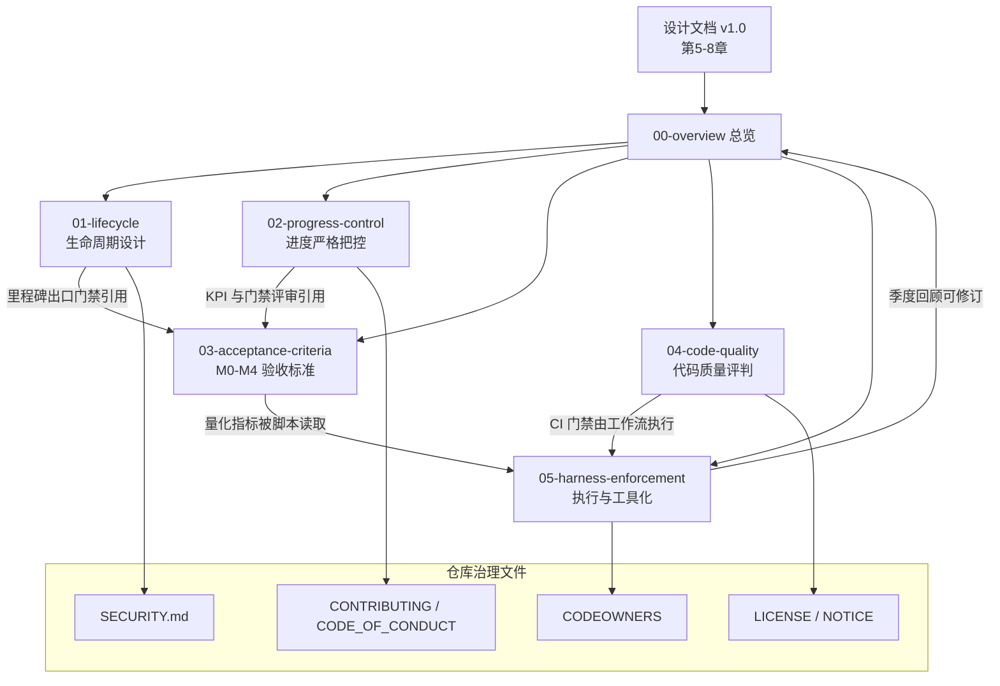

# Harness 框架总览

> **目的**：定义 Global News Radar 的 harness（工程化约束框架）总体结构，回答「这套约束是什么、为什么需要、由谁执行」。
> **适用范围**：仓库全部代码、文档、发布物与社区协作流程；对核心团队与社区贡献者同等生效。
> **关联文档**：`01-lifecycle.md`、`02-progress-control.md`、`03-acceptance-criteria.md`、`04-code-quality.md`、`05-harness-enforcement.md`；上游依据为《Global News Radar 设计文档 v1.0》第 5–8 章。

## 1. 为什么需要 harness

数据源型开源项目的两大死因已被先例反复验证：**烂尾**（核心团队投入衰减后无人接盘，TT-RSS 式的停更）与**质量滑坡**（源清单腐化、许可证污染、静默失败堆积，RSSHub 式的维护债）。Global News Radar 的差异化资产——1,000+ 媒体源清单、三级清洗管线、地域受限机制——恰恰全部是「持续运营型」资产：源从第一天起就在腐化，LLM 成本阀门需要持续盯守，许可证义务会穿透传递依赖。

harness 框架的对策是**把质量与进度从「依赖人的自觉」转为「依赖可执行的约束」**：每一条要求都必须满足三个条件——可量化（有数字门槛）、可自动化（CI 能检查）、可追溯（有记录可查）。不允许出现「代码要写好」「进度要把控」这类无法裁决的空话。

## 2. 四大支柱

| 支柱 | 文档 | 回答的问题 | 核心机制 |
|---|---|---|---|
| 生命周期 | `01-lifecycle.md` | 项目/版本/里程碑/安全事件各处于什么阶段，何时流转 | 四阶段项目模型、SemVer 与分支模型、M0–M4 入口/出口门禁、安全响应 SLA |
| 进度门禁 | `02-progress-control.md` | 进度如何度量、延期如何处置、社区任务如何防停滞 | 双周迭代 + Gate Review、KPI 表、黄灯/红灯升级、范围裁剪决策树、14 天停滞回收 |
| 验收标准 | `03-acceptance-criteria.md` | 每个里程碑「做到什么程度算完成」 | M0–M4 功能性量化指标、非功能性标准、Definition of Done、签字记录 |
| 代码质量 | `04-code-quality.md` | 每一行合入的代码须满足什么条件 | 双语言规范、覆盖率门槛、PR 评审 rubric、CI 门禁表、禁止事项 |

四支柱的关系：生命周期定义「阶段」，进度门禁保证「按时到达阶段出口」，验收标准定义「出口长什么样」，代码质量保证「到达出口的路径不埋雷」。`05-harness-enforcement.md` 是四支柱的执行层：CI/CD 工作流、门禁脚本与框架自身的修订机制。

## 3. 角色定义

| 角色 | 定义 | 关键权限 | 关键责任 |
|---|---|---|---|
| **Maintainer** | 项目维护者（核心团队，初期 3–6 人） | main 分支合并、仓库设置、Gate Review 签字、角色任免 | 保证里程碑出口达标；响应 SLA 兜底；主持 Gate Review |
| **Committer** | 长期贡献者，经 Maintainer 提名并由多数 Maintainer 同意授予 | 非主干分支直推、PR 评审（其 approve 计入必需评审数） | 持续高质量贡献；评审分担；不得单独合并自己的 PR |
| **Contributor** | 任何提交 PR/issue 的社区成员 | fork + PR、任务认领 | 遵守 CONTRIBUTING、行为准则与 `04-code-quality.md` 全部约束 |
| **源维护者**（Source Maintainer） | 媒体源适配器的认领人，复刻 RSSHub 路由维护者模式 | 所认领源的适配器/元数据/文档的优先评审权 | 目标站改版时及时修复；响应断更告警派单；连续失效且无人认领的源进入弃用清单 |
| **Release Manager** | 由 Maintainer 轮流担任的发布责任人，按里程碑轮换 | release 分支创建、tag 与发布说明签发、hotfix 决策 | 执行发布检查单；签发 Gate Review 记录；安全公告发布 |

角色映射到 GitHub：Maintainer = Admin/Maintain 权限 + CODEOWNERS 全局条目；Committer = Write 权限 + CODEOWNERS 目录条目；源维护者 = CODEOWNERS 中 `sources/adapters/` 子路径条目；Release Manager = environments 中 `release` 环境的 required reviewer。

## 4. 文档间关系

阅读顺序建议：新贡献者读 `00` + `04`；任务认领者加读 `02` 第 4 节；Maintainer 与 Release Manager 须通读全部五份；`03` 是 Gate Review 会议的唯一裁决依据。

## 5. 生效与修订

本框架随 M0 里程碑生效，效力等同于代码：修改任何 harness 文档均须走 PR 评审（流程见 `05-harness-enforcement.md` 第 4 节），且每季度强制回顾一次。框架与设计文档冲突时，以设计文档的事实性结论（如量化指标）为准，harness 负责将其转化为可执行约束。
